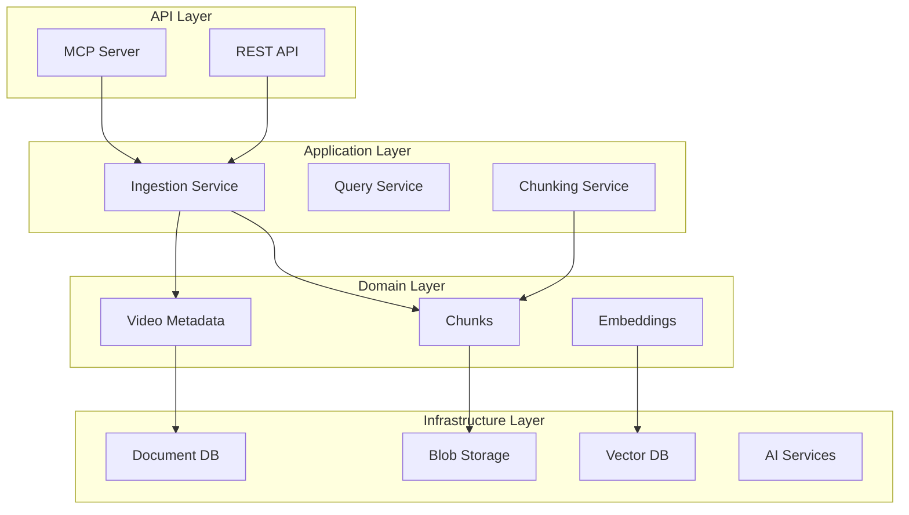

# Plan de Documentación Técnica con Docusaurus

## Resumen Ejecutivo

Este documento define el plan de acción para crear un sitio de documentación técnica completo usando Docusaurus, orientado 100% a desarrolladores y perfiles técnicos.

### Estado Actual
- **Documentación existente**: 7 archivos markdown (~5,000 líneas)
- **Cobertura**: Arquitectura, dominio, API, infraestructura, configuración, deployment
- **Gaps identificados**: Getting started, ejemplos de código, troubleshooting, guías de contribución

---

## Fase 1: Setup de Docusaurus

### 1.1 Inicialización del Proyecto

```bash
# Crear directorio para documentación
cd youtube_agent_tools
npx create-docusaurus@latest website classic --typescript

# Estructura resultante
website/
├── docs/              # Documentación principal
├── blog/              # (opcional) Blog técnico
├── src/               # Componentes React custom
├── static/            # Assets estáticos
├── docusaurus.config.ts
├── sidebars.ts
└── package.json
```

### 1.2 Configuración Base

**docusaurus.config.ts**:
- Título: "YouTube RAG Server"
- Tagline: "Multimodal Video RAG for LLM Agents"
- Theme: `@docusaurus/preset-classic`
- Features:
  - Algolia DocSearch (búsqueda)
  - Syntax highlighting (Prism)
  - Mermaid diagrams
  - Dark mode
  - Versioning

### 1.3 Plugins Recomendados
- `@docusaurus/plugin-ideal-image` - Optimización de imágenes
- `docusaurus-plugin-typedoc` - Documentación automática de TypeScript/Python
- `@docusaurus/theme-mermaid` - Diagramas
- `docusaurus-lunr-search` - Búsqueda offline (alternativa a Algolia)

---

## Fase 2: Estructura de Contenido

### 2.1 Arquitectura del Sidebar

```
📚 Docs
├── 🏠 Introduction
│   ├── Overview
│   ├── Quick Start
│   ├── Use Cases
│   └── FAQ
│
├── 🏗️ Architecture
│   ├── System Overview
│   ├── Hexagonal Architecture
│   ├── Data Flow
│   ├── Design Principles
│   └── Technology Stack
│
├── 📦 Domain Layer
│   ├── Overview
│   ├── Video Metadata
│   ├── Chunks (Multimodal)
│   ├── Embeddings
│   ├── Citations
│   ├── Value Objects
│   └── Exceptions
│
├── ⚙️ Application Layer
│   ├── Overview
│   ├── Video Ingestion Service
│   ├── Chunking Service
│   ├── Embedding Service
│   ├── Storage Service
│   ├── Query Service
│   ├── DTOs
│   └── Pipelines
│
├── 🔌 Infrastructure Layer
│   ├── Overview
│   ├── Blob Storage
│   │   ├── Abstract Interface
│   │   ├── MinIO Provider
│   │   └── S3/GCS/Azure
│   ├── Vector Database
│   │   ├── Abstract Interface
│   │   └── Qdrant Provider
│   ├── Document Database
│   │   ├── Abstract Interface
│   │   └── MongoDB Provider
│   ├── AI Services
│   │   ├── Transcription (Whisper)
│   │   ├── Embeddings (OpenAI/CLIP)
│   │   └── LLM (GPT-4o)
│   ├── Video Processing
│   │   ├── YouTube Downloader
│   │   ├── Frame Extractor
│   │   └── Video Chunker
│   ├── Factory Pattern
│   └── Adding New Providers
│
├── 🌐 API Layer
│   ├── Overview
│   ├── REST API Reference
│   │   ├── Ingestion Endpoints
│   │   ├── Query Endpoints
│   │   ├── Sources Endpoints
│   │   ├── Management Endpoints
│   │   └── Health Endpoints
│   ├── MCP Server
│   │   ├── Tool: ingest_video
│   │   ├── Tool: get_ingestion_status
│   │   ├── Tool: query_video
│   │   ├── Tool: get_sources
│   │   ├── Tool: list_videos
│   │   └── Tool: delete_video
│   ├── Error Handling
│   └── Rate Limiting
│
├── ⚙️ Configuration
│   ├── Overview
│   ├── Settings Hierarchy
│   ├── Environment Variables
│   ├── JSON Configuration Files
│   ├── Pydantic Models
│   └── Kubernetes Secrets
│
├── 🛠️ Development
│   ├── Local Setup
│   │   ├── Prerequisites
│   │   ├── Docker Compose
│   │   └── IDE Configuration
│   ├── Code Style
│   │   ├── Ruff Linting
│   │   ├── Mypy Type Checking
│   │   └── Conventional Commits
│   ├── Testing
│   │   ├── Unit Tests
│   │   ├── Integration Tests
│   │   └── E2E Tests
│   ├── Pre-commit Hooks
│   └── Debugging
│
├── 🚀 Deployment
│   ├── Docker
│   │   ├── Dockerfile
│   │   └── Multi-arch Builds
│   ├── Kubernetes
│   │   ├── Manifests
│   │   ├── Helm Charts
│   │   └── Secrets Management
│   ├── GitOps with ArgoCD
│   └── Monitoring & Observability
│       ├── Structured Logging
│       ├── Loki Integration
│       └── Metrics
│
├── 📖 Reference
│   ├── API Reference (OpenAPI)
│   ├── Configuration Reference
│   ├── Data Model Reference
│   ├── Error Codes
│   └── Glossary
│
└── 🤝 Contributing
    ├── Code of Conduct
    ├── Contributing Guide
    ├── Pull Request Process
    ├── Adding Providers
    └── Roadmap
```

---

## Fase 3: Migración de Contenido Existente

### 3.1 Mapeo de Documentos Actuales

| Archivo Actual | Destino Docusaurus |
|----------------|-------------------|
| `00-PROJECT-OVERVIEW.md` | `introduction/overview.md` + `introduction/use-cases.md` |
| `01-ARCHITECTURE.md` | `architecture/` (split en múltiples archivos) |
| `02-DOMAIN-MODELS.md` | `domain/` (un archivo por entidad) |
| `03-API-TOOLS.md` | `api/rest/` + `api/mcp/` |
| `04-INFRASTRUCTURE.md` | `infrastructure/` (split por servicio) |
| `05-CONFIGURATION.md` | `configuration/` |
| `06-DEPLOYMENT.md` | `deployment/` |
| `07-IMPLEMENTATION-TASKS.md` | `reference/implementation-status.md` |

### 3.2 Contenido Nuevo a Crear

#### Prioridad Alta (Día 1-2)
1. **Quick Start Guide** - 5-minute tutorial
2. **Local Development Setup** - Docker Compose, prerequisites
3. **Code Examples** - Python snippets para cada servicio

#### Prioridad Media (Día 3-4)
4. **Testing Guide** - Cómo correr y escribir tests
5. **Adding Providers Guide** - Tutorial paso a paso
6. **Troubleshooting** - Errores comunes y soluciones

#### Prioridad Baja (Día 5+)
7. **FAQ** - Preguntas frecuentes
8. **Glossary** - Términos técnicos
9. **Changelog** - Historial de versiones
10. **Contributing Guide** - Proceso de contribución

---

## Fase 4: Features Técnicas

### 4.1 Diagramas con Mermaid

```markdown

```

### 4.2 Code Tabs para Múltiples Lenguajes

```mdx
import Tabs from '@theme/Tabs';
import TabItem from '@theme/TabItem';

<Tabs>
  <TabItem value="python" label="Python" default>
    ```python
    from src.application.services import VideoIngestionService

    service = VideoIngestionService(...)
    result = await service.ingest("https://youtube.com/watch?v=...")
    ```
  </TabItem>
  <TabItem value="curl" label="cURL">
    ```bash
    curl -X POST http://localhost:8000/api/v1/videos/ingest \
      -H "Content-Type: application/json" \
      -d '{"url": "https://youtube.com/watch?v=..."}'
    ```
  </TabItem>
</Tabs>
```

### 4.3 Admonitions para Notas Técnicas

```markdown
:::info Arquitectura Hexagonal
El proyecto sigue el patrón Ports & Adapters para desacoplar la lógica de negocio de la infraestructura.
:::

:::warning Requisito
FFmpeg debe estar instalado en el sistema para el procesamiento de video.
:::

:::danger Breaking Change
A partir de v2.0, el formato de configuración cambia de YAML a JSON.
:::
```

### 4.4 API Reference Automática

Integrar **Redoc** o **Swagger UI** embebido para la documentación OpenAPI:

```tsx
// src/components/ApiDoc.tsx
import SwaggerUI from 'swagger-ui-react';
import 'swagger-ui-react/swagger-ui.css';

export default function ApiDoc() {
  return <SwaggerUI url="/openapi.json" />;
}
```

---

## Fase 5: Generación Automática de Docs

### 5.1 Docstrings → Markdown

Usar `pydoc-markdown` o `sphinx-autodoc` para generar documentación desde docstrings:

```yaml
# pydoc-markdown.yml
loaders:
  - type: python
    search_path: [src]

renderer:
  type: docusaurus
  docs_base_path: website/docs
  relative_output_path: api-reference
```

### 5.2 OpenAPI → Docusaurus

Generar documentación REST desde el schema OpenAPI:

```bash
npx @redocly/cli build-docs openapi.yaml -o website/static/api.html
```

### 5.3 Type Definitions → Reference

Para tipos Pydantic, generar referencia automática:

```python
# Script para generar markdown desde modelos Pydantic
from src.domain.models import VideoMetadata
import json

schema = VideoMetadata.model_json_schema()
# Convertir a markdown table
```

---

## Fase 6: CI/CD para Documentación

### 6.1 GitHub Actions

```yaml
# .github/workflows/docs.yml
name: Deploy Docs

on:
  push:
    branches: [main]
    paths:
      - 'website/**'
      - 'docs/**'

jobs:
  deploy:
    runs-on: ubuntu-latest
    steps:
      - uses: actions/checkout@v4

      - name: Setup Node
        uses: actions/setup-node@v4
        with:
          node-version: 20

      - name: Install dependencies
        run: cd website && npm ci

      - name: Build
        run: cd website && npm run build

      - name: Deploy to GitHub Pages
        uses: peaceiris/actions-gh-pages@v3
        with:
          github_token: ${{ secrets.GITHUB_TOKEN }}
          publish_dir: ./website/build
```

### 6.2 Preview de PRs

```yaml
# Preview automático para cada PR
- name: Deploy Preview
  uses: nwtgck/actions-netlify@v2
  with:
    publish-dir: './website/build'
    github-token: ${{ secrets.GITHUB_TOKEN }}
```

---

## Fase 7: Estructura de Archivos Final

```
youtube_agent_tools/
├── docs/                          # Docs originales (mantener como backup)
│   └── *.md
│
├── website/                       # Docusaurus site
│   ├── docs/
│   │   ├── introduction/
│   │   │   ├── _category_.json
│   │   │   ├── overview.md
│   │   │   ├── quick-start.md
│   │   │   ├── use-cases.md
│   │   │   └── faq.md
│   │   │
│   │   ├── architecture/
│   │   │   ├── _category_.json
│   │   │   ├── overview.md
│   │   │   ├── hexagonal.md
│   │   │   ├── data-flow.md
│   │   │   ├── design-principles.md
│   │   │   └── tech-stack.md
│   │   │
│   │   ├── domain/
│   │   │   ├── _category_.json
│   │   │   ├── overview.md
│   │   │   ├── video-metadata.md
│   │   │   ├── chunks.md
│   │   │   ├── embeddings.md
│   │   │   ├── citations.md
│   │   │   ├── value-objects.md
│   │   │   └── exceptions.md
│   │   │
│   │   ├── application/
│   │   │   ├── _category_.json
│   │   │   ├── overview.md
│   │   │   ├── ingestion-service.md
│   │   │   ├── chunking-service.md
│   │   │   ├── embedding-service.md
│   │   │   ├── storage-service.md
│   │   │   ├── query-service.md
│   │   │   ├── dtos.md
│   │   │   └── pipelines.md
│   │   │
│   │   ├── infrastructure/
│   │   │   ├── _category_.json
│   │   │   ├── overview.md
│   │   │   ├── blob-storage/
│   │   │   │   ├── interface.md
│   │   │   │   ├── minio.md
│   │   │   │   └── cloud-providers.md
│   │   │   ├── vector-db/
│   │   │   │   ├── interface.md
│   │   │   │   └── qdrant.md
│   │   │   ├── document-db/
│   │   │   │   ├── interface.md
│   │   │   │   └── mongodb.md
│   │   │   ├── ai-services/
│   │   │   │   ├── transcription.md
│   │   │   │   ├── embeddings.md
│   │   │   │   └── llm.md
│   │   │   ├── video-processing/
│   │   │   │   ├── youtube-downloader.md
│   │   │   │   ├── frame-extractor.md
│   │   │   │   └── video-chunker.md
│   │   │   ├── factory.md
│   │   │   └── adding-providers.md
│   │   │
│   │   ├── api/
│   │   │   ├── _category_.json
│   │   │   ├── overview.md
│   │   │   ├── rest/
│   │   │   │   ├── ingestion.md
│   │   │   │   ├── query.md
│   │   │   │   ├── sources.md
│   │   │   │   ├── management.md
│   │   │   │   └── health.md
│   │   │   ├── mcp/
│   │   │   │   ├── overview.md
│   │   │   │   └── tools.md
│   │   │   ├── errors.md
│   │   │   └── rate-limiting.md
│   │   │
│   │   ├── configuration/
│   │   │   ├── _category_.json
│   │   │   ├── overview.md
│   │   │   ├── hierarchy.md
│   │   │   ├── environment-variables.md
│   │   │   ├── json-files.md
│   │   │   ├── pydantic-models.md
│   │   │   └── kubernetes-secrets.md
│   │   │
│   │   ├── development/
│   │   │   ├── _category_.json
│   │   │   ├── local-setup.md
│   │   │   ├── docker-compose.md
│   │   │   ├── code-style.md
│   │   │   ├── testing.md
│   │   │   ├── pre-commit.md
│   │   │   └── debugging.md
│   │   │
│   │   ├── deployment/
│   │   │   ├── _category_.json
│   │   │   ├── overview.md
│   │   │   ├── docker.md
│   │   │   ├── kubernetes.md
│   │   │   ├── gitops.md
│   │   │   └── monitoring.md
│   │   │
│   │   ├── reference/
│   │   │   ├── _category_.json
│   │   │   ├── api-reference.md
│   │   │   ├── config-reference.md
│   │   │   ├── data-models.md
│   │   │   ├── error-codes.md
│   │   │   ├── glossary.md
│   │   │   └── implementation-status.md
│   │   │
│   │   └── contributing/
│   │       ├── _category_.json
│   │       ├── code-of-conduct.md
│   │       ├── contributing.md
│   │       ├── pull-requests.md
│   │       ├── adding-providers.md
│   │       └── roadmap.md
│   │
│   ├── src/
│   │   ├── components/
│   │   │   ├── ApiDoc.tsx
│   │   │   ├── ArchitectureDiagram.tsx
│   │   │   └── CodeExample.tsx
│   │   ├── css/
│   │   │   └── custom.css
│   │   └── pages/
│   │       └── index.tsx
│   │
│   ├── static/
│   │   ├── img/
│   │   │   ├── logo.svg
│   │   │   ├── favicon.ico
│   │   │   └── architecture/
│   │   │       ├── system-overview.png
│   │   │       ├── data-flow.png
│   │   │       └── layers.png
│   │   └── openapi.json
│   │
│   ├── docusaurus.config.ts
│   ├── sidebars.ts
│   ├── package.json
│   └── tsconfig.json
│
└── scripts/
    ├── generate-api-docs.py      # Genera docs desde OpenAPI
    ├── generate-model-docs.py    # Genera docs desde Pydantic
    └── sync-docs.sh              # Sincroniza docs/ → website/docs/
```

---

## Cronograma Estimado

| Fase | Descripción | Duración |
|------|-------------|----------|
| 1 | Setup Docusaurus + config base | 2-3 horas |
| 2 | Definir estructura sidebar | 1-2 horas |
| 3 | Migrar documentación existente | 4-6 horas |
| 4 | Implementar features técnicas (Mermaid, tabs) | 2-3 horas |
| 5 | Crear contenido nuevo (Quick Start, guides) | 6-8 horas |
| 6 | Generación automática de docs | 3-4 horas |
| 7 | CI/CD + GitHub Pages | 2-3 horas |
| 8 | Review, polish, testing | 2-3 horas |

**Total estimado: 22-32 horas de trabajo**

---

## Checklist de Implementación

### Setup Inicial
- [ ] Crear proyecto Docusaurus con TypeScript
- [ ] Configurar `docusaurus.config.ts`
- [ ] Configurar `sidebars.ts`
- [ ] Instalar plugins (Mermaid, search, etc.)
- [ ] Configurar theme y branding

### Migración de Contenido
- [ ] Migrar `00-PROJECT-OVERVIEW.md`
- [ ] Migrar `01-ARCHITECTURE.md`
- [ ] Migrar `02-DOMAIN-MODELS.md`
- [ ] Migrar `03-API-TOOLS.md`
- [ ] Migrar `04-INFRASTRUCTURE.md`
- [ ] Migrar `05-CONFIGURATION.md`
- [ ] Migrar `06-DEPLOYMENT.md`
- [ ] Migrar `07-IMPLEMENTATION-TASKS.md`

### Contenido Nuevo
- [ ] Quick Start Guide
- [ ] Local Development Setup
- [ ] Testing Guide
- [ ] Adding Providers Tutorial
- [ ] Troubleshooting Guide
- [ ] FAQ
- [ ] Glossary
- [ ] Contributing Guide
- [ ] Code of Conduct
- [ ] Changelog template

### Features Técnicas
- [ ] Diagramas Mermaid funcionando
- [ ] Code tabs multi-lenguaje
- [ ] Admonitions configurados
- [ ] API Reference embebido
- [ ] Búsqueda funcionando
- [ ] Dark mode

### CI/CD
- [ ] GitHub Actions para deploy
- [ ] PR previews
- [ ] Auto-generación de docs desde código

### Quality Assurance
- [ ] Links internos funcionando
- [ ] Imágenes optimizadas
- [ ] SEO meta tags
- [ ] Mobile responsive
- [ ] Build sin errores
- [ ] Navegación intuitiva

---

## Próximos Pasos Inmediatos

1. **Aprobar este plan** - Revisar y ajustar según necesidades
2. **Ejecutar setup de Docusaurus** - Inicializar proyecto
3. **Migrar primer batch de docs** - Empezar con Introduction y Architecture
4. **Validar estructura** - Asegurar que la navegación sea intuitiva
5. **Iterar** - Agregar contenido nuevo progresivamente

---

## Recursos

- [Docusaurus Documentation](https://docusaurus.io/docs)
- [Mermaid Diagrams](https://mermaid.js.org/)
- [GitHub Pages Deploy](https://docusaurus.io/docs/deployment#deploying-to-github-pages)
- [Algolia DocSearch](https://docsearch.algolia.com/)
