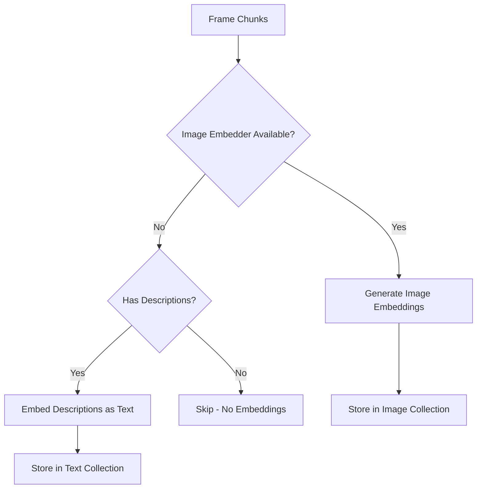

# Embedding Orchestrator

The `EmbeddingOrchestrator` manages batch embedding generation for different content types, handling text and image embeddings with storage to the vector database.

**Source**: `src/application/services/embedding.py`

## Overview

The embedding orchestrator:

- Generates text embeddings for transcript chunks
- Generates image embeddings for frame chunks (or falls back to text)
- Stores vectors with rich metadata payloads
- Handles batching for efficient API usage
- Tracks statistics for monitoring

## Class Definition

```python
class EmbeddingOrchestrator:
    """Orchestrates embedding generation for different content types."""

    def __init__(
        self,
        text_embedder: EmbeddingServiceBase,
        image_embedder: EmbeddingServiceBase | None,
        vector_db: VectorDBBase,
        text_collection: str,
        image_collection: str | None = None,
    ) -> None:
        ...
```

### Dependencies

| Dependency | Type | Purpose |
|------------|------|---------|
| `text_embedder` | `EmbeddingServiceBase` | Generate text embeddings (OpenAI) |
| `image_embedder` | `EmbeddingServiceBase` | Generate image embeddings (CLIP) |
| `vector_db` | `VectorDBBase` | Store vectors (Qdrant) |
| `text_collection` | `str` | Collection name for text vectors |
| `image_collection` | `str` | Collection name for image vectors |

## Statistics

```python
@dataclass
class EmbeddingStats:
    """Statistics from embedding generation."""

    total_items: int       # Total chunks processed
    text_embeddings: int   # Text embeddings generated
    image_embeddings: int  # Image embeddings generated
    vectors_stored: int    # Vectors stored in DB
    failed_items: int      # Failed embedding attempts
```

## Methods

### `embed_transcript_chunks()`

Generate and store embeddings for transcript chunks.

```python
async def embed_transcript_chunks(
    self,
    chunks: list[TranscriptChunk],
    video_id: str,
) -> EmbeddingStats:
    """Generate and store embeddings for transcript chunks.

    Args:
        chunks: Transcript chunks to embed.
        video_id: Parent video ID.

    Returns:
        Statistics about the embedding operation.
    """
```

#### Example

```python
from src.domain.models.chunk import TranscriptChunk

chunks = [
    TranscriptChunk(
        video_id="550e8400...",
        text="Welcome to this Python tutorial...",
        language="en",
        confidence=0.95,
        start_time=0.0,
        end_time=30.0,
        word_timestamps=[...],
    ),
    # ... more chunks
]

stats = await orchestrator.embed_transcript_chunks(chunks, video_id="550e8400...")

print(f"Processed: {stats.total_items}")
print(f"Embeddings: {stats.text_embeddings}")
print(f"Stored: {stats.vectors_stored}")
print(f"Failed: {stats.failed_items}")
```

#### Vector Payload

Each vector is stored with metadata for filtering and retrieval:

```python
payload = {
    "video_id": video_id,
    "chunk_id": chunk.id,
    "modality": "transcript",
    "start_time": chunk.start_time,
    "end_time": chunk.end_time,
    "text_preview": chunk.text[:200],
    "language": chunk.language,
    "confidence": chunk.confidence,
}
```

### `embed_frame_chunks()`

Generate and store embeddings for frame chunks.

```python
async def embed_frame_chunks(
    self,
    chunks: list[FrameChunk],
    video_id: str,
) -> EmbeddingStats:
    """Generate and store embeddings for frame chunks.

    Args:
        chunks: Frame chunks to embed.
        video_id: Parent video ID.

    Returns:
        Statistics about the embedding operation.
    """
```

#### Embedding Strategy

The orchestrator uses different strategies based on available services:



#### Example with Image Embeddings

```python
# With image embedder configured
stats = await orchestrator.embed_frame_chunks(frames, video_id="550e8400...")

print(f"Image embeddings: {stats.image_embeddings}")
```

#### Example with Text Fallback

```python
# Without image embedder, uses frame descriptions
frames_with_descriptions = [
    FrameChunk(
        video_id="550e8400...",
        frame_number=0,
        start_time=0.0,
        end_time=5.0,
        blob_path="frames/frame_00000.jpg",
        description="A person standing in front of a whiteboard",
        ...
    ),
]

stats = await orchestrator.embed_frame_chunks(
    frames_with_descriptions,
    video_id="550e8400..."
)

print(f"Text embeddings (from descriptions): {stats.text_embeddings}")
```

### `embed_chunks()`

Embed a mixed list of chunks, automatically routing by type.

```python
async def embed_chunks(
    self,
    chunks: list[AnyChunk],
    video_id: str,
) -> EmbeddingStats:
    """Embed a mixed list of chunks.

    Args:
        chunks: Mixed chunk types to embed.
        video_id: Parent video ID.

    Returns:
        Combined statistics.
    """
```

#### Example

```python
from src.domain.models.chunk import AnyChunk

# Mix of transcript and frame chunks
all_chunks: list[AnyChunk] = transcript_chunks + frame_chunks

stats = await orchestrator.embed_chunks(all_chunks, video_id="550e8400...")

print(f"Total processed: {stats.total_items}")
print(f"Text embeddings: {stats.text_embeddings}")
print(f"Image embeddings: {stats.image_embeddings}")
```

### `delete_video_embeddings()`

Delete all embeddings for a video.

```python
async def delete_video_embeddings(self, video_id: str) -> int:
    """Delete all embeddings for a video.

    Args:
        video_id: Video ID to delete embeddings for.

    Returns:
        Number of vectors deleted.
    """
```

#### Example

```python
deleted = await orchestrator.delete_video_embeddings("550e8400...")
print(f"Deleted {deleted} vectors")
```

## Batching

The orchestrator processes embeddings in batches to respect API limits:

```python
# Process in batches based on embedder limits
batch_size = self._text_embedder.max_batch_size  # e.g., 100

for i in range(0, len(chunks), batch_size):
    batch = chunks[i : i + batch_size]
    texts = [chunk.text for chunk in batch]

    # Single API call for batch
    embeddings = await self._text_embedder.embed_texts(texts)
```

### Batch Size Configuration

| Embedding Service | Typical Batch Size |
|-------------------|-------------------|
| OpenAI text-embedding-3-small | 100 |
| OpenAI text-embedding-3-large | 100 |
| CLIP | 32 |

## Collection Management

The orchestrator ensures collections exist before storing vectors:

```python
async def _ensure_collection(self, name: str, dimensions: int) -> None:
    """Ensure a vector collection exists."""
    if not await self._vector_db.collection_exists(name):
        await self._vector_db.create_collection(
            name=name,
            vector_size=dimensions,
            distance_metric="cosine",
        )
```

### Vector Dimensions

| Model | Dimensions |
|-------|------------|
| text-embedding-3-small | 1536 |
| text-embedding-3-large | 3072 |
| CLIP ViT-B/32 | 512 |
| CLIP ViT-L/14 | 768 |

## Error Handling

The orchestrator handles batch failures gracefully:

```python
for i in range(0, len(chunks), batch_size):
    batch = chunks[i : i + batch_size]

    try:
        embeddings = await self._text_embedder.embed_texts(texts)
        # Process successful embeddings...
    except Exception:
        failed += len(batch)  # Track failures, continue with next batch
```

Failed items are counted but don't stop the entire operation.

## Usage with Ingestion Service

The `EmbeddingOrchestrator` is typically used within the ingestion pipeline:

```python
class VideoIngestionService:
    async def ingest(self, request: IngestVideoRequest) -> IngestVideoResponse:
        # ... download, transcribe, chunk ...

        # Generate embeddings
        await self._generate_and_store_embeddings(
            chunks=transcript_chunks,
            video_id=video_metadata.id,
        )

    async def _generate_and_store_embeddings(
        self,
        chunks: list[TranscriptChunk],
        video_id: str,
    ) -> None:
        # Ensure collection exists
        if not await self._vector_db.collection_exists(self._vectors_collection):
            await self._vector_db.create_collection(
                name=self._vectors_collection,
                vector_size=self._text_embedder.text_dimensions,
                distance_metric="cosine",
            )

        # Batch embed and store
        for i in range(0, len(texts), batch_size):
            embeddings = await self._text_embedder.embed_texts(batch_texts)
            # Store with payloads...
```

## Performance Considerations

### Parallelization

For large videos, consider parallelizing embedding generation:

```python
import asyncio

async def embed_in_parallel(chunks: list[TranscriptChunk]) -> EmbeddingStats:
    # Split into groups
    mid = len(chunks) // 2
    first_half = chunks[:mid]
    second_half = chunks[mid:]

    # Process in parallel
    stats1, stats2 = await asyncio.gather(
        orchestrator.embed_transcript_chunks(first_half, video_id),
        orchestrator.embed_transcript_chunks(second_half, video_id),
    )

    # Combine stats
    return EmbeddingStats(
        total_items=stats1.total_items + stats2.total_items,
        text_embeddings=stats1.text_embeddings + stats2.text_embeddings,
        image_embeddings=stats1.image_embeddings + stats2.image_embeddings,
        vectors_stored=stats1.vectors_stored + stats2.vectors_stored,
        failed_items=stats1.failed_items + stats2.failed_items,
    )
```

### Caching

For repeated queries, consider caching embeddings:

```python
# Check if embedding exists before generating
existing = await vector_db.get_by_id(collection, chunk.id)
if existing:
    continue  # Skip, already embedded
```
