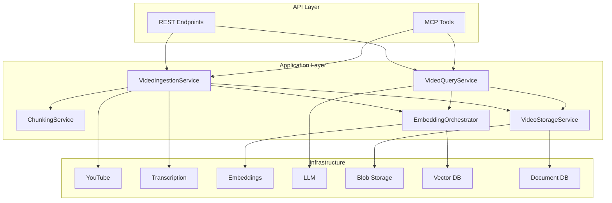

# Application Layer

The Application Layer orchestrates business logic and coordinates between the domain and infrastructure layers. It contains services that implement use cases, DTOs for API boundaries, and pipelines for multi-step workflows.

## Overview

```
src/application/
├── services/           # Business logic orchestration
│   ├── ingestion.py    # Video ingestion pipeline
│   ├── chunking.py     # Content chunking
│   ├── embedding.py    # Embedding generation
│   ├── query.py        # Semantic search & RAG
│   └── storage.py      # Storage management
├── dtos/               # Data Transfer Objects
│   ├── ingestion.py    # Ingestion DTOs
│   └── query.py        # Query DTOs
└── pipelines/          # Multi-step workflows
```

## Architecture

The Application Layer follows the **Service Pattern** where each service:

1. **Receives abstract dependencies** via constructor injection
2. **Orchestrates domain operations** without knowing infrastructure details
3. **Returns DTOs** suitable for API responses



## Services

| Service | Purpose | Key Methods |
|---------|---------|-------------|
| [VideoIngestionService](ingestion-service.md) | Complete video ingestion pipeline | `ingest()`, `get_ingestion_status()`, `delete_video()` |
| [ChunkingService](chunking-service.md) | Create chunks from media | `create_transcript_chunks()`, `extract_frame_chunks()` |
| [EmbeddingOrchestrator](embedding-service.md) | Generate and store embeddings | `embed_transcript_chunks()`, `embed_frame_chunks()` |
| [VideoQueryService](query-service.md) | Semantic search with RAG | `query()` |
| [VideoStorageService](storage-service.md) | Manage blobs and metadata | `upload_video()`, `save_chunks()` |

## DTOs

Data Transfer Objects define the contract between the API and Application layers:

| Module | Key DTOs |
|--------|----------|
| [Ingestion DTOs](dtos.md#ingestion-dtos) | `IngestVideoRequest`, `IngestVideoResponse`, `IngestionProgress` |
| [Query DTOs](dtos.md#query-dtos) | `QueryVideoRequest`, `QueryVideoResponse`, `CitationDTO` |

## Design Principles

### Dependency Injection

All services receive their dependencies through constructor injection:

```python
class VideoIngestionService:
    def __init__(
        self,
        youtube_downloader: YouTubeDownloaderBase,  # Abstract
        transcription_service: TranscriptionServiceBase,  # Abstract
        text_embedding_service: EmbeddingServiceBase,  # Abstract
        blob_storage: BlobStorageBase,  # Abstract
        vector_db: VectorDBBase,  # Abstract
        document_db: DocumentDBBase,  # Abstract
        settings: Settings,
    ) -> None:
        ...
```

This enables:

- **Testability**: Mock dependencies in unit tests
- **Flexibility**: Swap implementations without changing business logic
- **Decoupling**: Services don't know about concrete infrastructure

### Error Handling

Services define domain-specific exceptions:

```python
class IngestionError(Exception):
    """Base exception for ingestion errors."""

    def __init__(self, message: str, step: ProcessingStep) -> None:
        self.step = step
        super().__init__(message)
```

### Progress Reporting

Long-running operations support progress callbacks:

```python
async def ingest(
    self,
    request: IngestVideoRequest,
    progress_callback: Callable[[IngestionProgress], None] | None = None,
) -> IngestVideoResponse:
    ...
```

## Usage Example

```python
from src.application import VideoIngestionService, IngestVideoRequest
from src.infrastructure.factory import create_services

# Create services using factory
services = create_services(settings)

# Create ingestion service with dependencies
ingestion_service = VideoIngestionService(
    youtube_downloader=services.youtube_downloader,
    transcription_service=services.transcription,
    text_embedding_service=services.text_embedder,
    blob_storage=services.blob_storage,
    vector_db=services.vector_db,
    document_db=services.document_db,
    settings=settings,
)

# Ingest a video
request = IngestVideoRequest(
    url="https://youtube.com/watch?v=dQw4w9WgXcQ",
    extract_frames=True,
)

response = await ingestion_service.ingest(request)
print(f"Video ID: {response.video_id}")
print(f"Chunks: {response.chunk_counts}")
```

## Next Steps

- [Video Ingestion Service](ingestion-service.md) - Complete ingestion pipeline
- [Query Service](query-service.md) - Semantic search and RAG
- [DTOs Reference](dtos.md) - Data transfer objects
