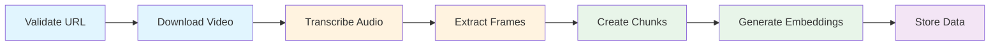

# Video Ingestion Service

The `VideoIngestionService` orchestrates the complete video ingestion pipeline, from downloading YouTube videos to storing searchable embeddings.

**Source**: `src/application/services/ingestion.py`

## Overview

The ingestion service coordinates multiple infrastructure components to:

1. Download videos from YouTube
2. Transcribe audio with word-level timestamps
3. Extract video frames at intervals
4. Create overlapping content chunks
5. Generate embeddings for semantic search
6. Store everything in appropriate databases

## Pipeline Steps



### Step Details

| Step | Description | Progress Range |
|------|-------------|----------------|
| `VALIDATING` | Validate YouTube URL and check for duplicates | 0% - 5% |
| `DOWNLOADING` | Download video/audio and upload to blob storage | 5% - 20% |
| `TRANSCRIBING` | Transcribe audio using Whisper | 20% - 40% |
| `EXTRACTING_FRAMES` | Extract frames at configured intervals | 40% - 50% |
| `CHUNKING` | Create transcript chunks with overlap | 50% - 60% |
| `EMBEDDING` | Generate embeddings for all chunks | 60% - 85% |
| `STORING` | Store chunks in document database | 85% - 100% |

## Class Definition

```python
class VideoIngestionService:
    """Orchestrates the complete video ingestion pipeline."""

    def __init__(
        self,
        youtube_downloader: YouTubeDownloaderBase,
        transcription_service: TranscriptionServiceBase,
        text_embedding_service: EmbeddingServiceBase,
        frame_extractor: FrameExtractorBase,
        blob_storage: BlobStorageBase,
        vector_db: VectorDBBase,
        document_db: DocumentDBBase,
        settings: Settings,
    ) -> None:
        ...
```

### Dependencies

| Dependency | Type | Purpose |
|------------|------|---------|
| `youtube_downloader` | `YouTubeDownloaderBase` | Download videos from YouTube |
| `transcription_service` | `TranscriptionServiceBase` | Transcribe audio (Whisper) |
| `text_embedding_service` | `EmbeddingServiceBase` | Generate text embeddings |
| `frame_extractor` | `FrameExtractorBase` | Extract video frames (FFmpeg) |
| `blob_storage` | `BlobStorageBase` | Store video/audio/frames |
| `vector_db` | `VectorDBBase` | Store embeddings (Qdrant) |
| `document_db` | `DocumentDBBase` | Store metadata (MongoDB) |
| `settings` | `Settings` | Application configuration |

## Methods

### `ingest()`

Main method to ingest a YouTube video through the complete pipeline.

```python
async def ingest(
    self,
    request: IngestVideoRequest,
    progress_callback: Callable[[IngestionProgress], None] | None = None,
) -> IngestVideoResponse:
    """Ingest a YouTube video through the complete pipeline.

    Args:
        request: Ingestion request with URL and options.
        progress_callback: Optional callback for progress updates.

    Returns:
        Response with video ID and ingestion results.

    Raises:
        IngestionError: If any pipeline step fails.
    """
```

#### Example

```python
from src.application.dtos import IngestVideoRequest, IngestionProgress

# Define progress callback
def on_progress(progress: IngestionProgress) -> None:
    print(f"[{progress.current_step.value}] {progress.message}")
    print(f"  Progress: {progress.overall_progress:.1%}")

# Create request
request = IngestVideoRequest(
    url="https://www.youtube.com/watch?v=dQw4w9WgXcQ",
    language_hint="en",
    extract_frames=True,
    max_resolution=720,
)

# Ingest with progress tracking
response = await service.ingest(request, progress_callback=on_progress)

print(f"Video ID: {response.video_id}")
print(f"Status: {response.status}")
print(f"Chunks created: {response.chunk_counts}")
```

#### Output

```
[validating] Validating URL...
  Progress: 0.0%
[downloading] Downloading video...
  Progress: 10.0%
[transcribing] Transcribing audio...
  Progress: 20.0%
[extracting_frames] Extracting frames...
  Progress: 40.0%
[chunking] Creating transcript chunks...
  Progress: 50.0%
[embedding] Generating embeddings...
  Progress: 60.0%
[storing] Storing chunks...
  Progress: 85.0%
[completed] Ingestion complete!
  Progress: 100.0%

Video ID: 550e8400-e29b-41d4-a716-446655440000
Status: completed
Chunks created: {'transcript': 42, 'frame': 85}
```

### `get_ingestion_status()`

Get current ingestion status for a video.

```python
async def get_ingestion_status(
    self,
    video_id: str
) -> IngestVideoResponse | None:
    """Get current ingestion status for a video.

    Args:
        video_id: Internal video UUID.

    Returns:
        Current status or None if not found.
    """
```

#### Example

```python
status = await service.get_ingestion_status("550e8400-e29b-41d4-a716-446655440000")

if status:
    print(f"Status: {status.status}")
    print(f"Title: {status.title}")
    if status.progress:
        print(f"Current step: {status.progress.current_step}")
```

### `list_videos()`

List ingested videos with optional filtering.

```python
async def list_videos(
    self,
    status: VideoStatus | None = None,
    skip: int = 0,
    limit: int = 20,
) -> list[IngestVideoResponse]:
    """List ingested videos with optional filtering.

    Args:
        status: Optional status filter.
        skip: Number of videos to skip.
        limit: Maximum videos to return.

    Returns:
        List of video responses.
    """
```

#### Example

```python
from src.domain.models.video import VideoStatus

# List all ready videos
videos = await service.list_videos(status=VideoStatus.READY, limit=10)

for video in videos:
    print(f"{video.title} ({video.duration_seconds}s)")
    print(f"  Chunks: {video.chunk_counts}")
```

### `delete_video()`

Delete a video and all associated data.

```python
async def delete_video(self, video_id: str) -> bool:
    """Delete a video and all associated data.

    Args:
        video_id: Internal video UUID.

    Returns:
        True if deleted, False if not found.
    """
```

This method removes:

- Vector embeddings from Qdrant
- Chunk documents from MongoDB
- Video/audio/frame blobs from MinIO
- Video metadata document

#### Example

```python
deleted = await service.delete_video("550e8400-e29b-41d4-a716-446655440000")

if deleted:
    print("Video and all associated data deleted")
else:
    print("Video not found")
```

## Error Handling

The service wraps errors in `IngestionError` with the failing step:

```python
class IngestionError(Exception):
    """Base exception for ingestion errors."""

    def __init__(self, message: str, step: ProcessingStep) -> None:
        self.step = step
        super().__init__(message)
```

### Error Recovery

```python
try:
    response = await service.ingest(request)
except IngestionError as e:
    print(f"Ingestion failed at step: {e.step.value}")
    print(f"Error: {e}")

    # Video metadata is marked as FAILED in the database
    # with the error message for debugging
```

## Duplicate Detection

The service automatically detects if a video has already been ingested:

```python
# If video already exists, returns existing metadata
existing = await self._document_db.find_one(
    self._videos_collection,
    {"youtube_id": video_id},
)
if existing:
    return await self._build_response_from_existing(existing, started_at)
```

## Chunking Strategy

Transcript chunks are created with configurable overlap to preserve context:

```python
# From settings
chunk_seconds = self._settings.chunking.transcript.chunk_seconds  # e.g., 30
overlap_seconds = self._settings.chunking.transcript.overlap_seconds  # e.g., 5

# Results in chunks like:
# Chunk 1: 0:00 - 0:30
# Chunk 2: 0:25 - 0:55  (5 second overlap)
# Chunk 3: 0:50 - 1:20
# ...
```

## Storage Structure

### Blob Storage (MinIO)

```
videos/
├── {video_id}/
│   ├── video.mp4
│   └── audio.mp3

frames/
├── {video_id}/
│   └── frames/
│       ├── frame_00000.jpg
│       ├── thumb_00000.jpg
│       ├── frame_00001.jpg
│       └── ...
```

### Document Database (MongoDB)

- **videos**: Video metadata documents
- **transcript_chunks**: Transcript chunk documents with word timestamps
- **frame_chunks**: Frame chunk documents with blob paths

### Vector Database (Qdrant)

- **transcripts**: Text embeddings with temporal metadata payload

## Configuration

Key settings that affect ingestion:

```json
{
  "chunking": {
    "transcript": {
      "chunk_seconds": 30,
      "overlap_seconds": 5
    },
    "frame": {
      "interval_seconds": 5
    }
  }
}
```

See [Configuration](../configuration/index.md) for full settings reference.
