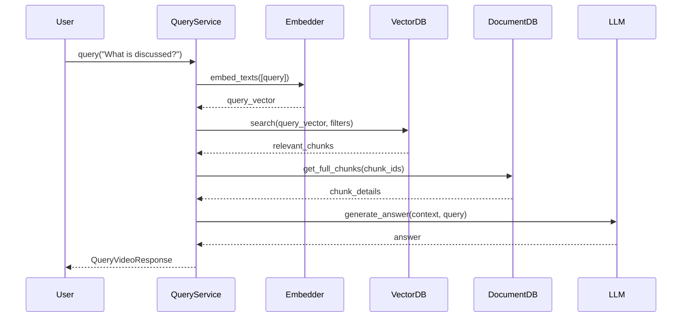

# Video Query Service

The `VideoQueryService` performs semantic search and RAG (Retrieval-Augmented Generation) over video content, returning answers with temporal citations.

**Source**: `src/application/services/query.py`

## Overview

The query service:

- Generates embeddings for user queries
- Performs vector similarity search across video chunks
- Retrieves full context from document database
- Uses LLM to generate answers based on context
- Returns citations with timestamps and YouTube links

## Architecture



## Class Definition

```python
class VideoQueryService:
    """Service for querying video content using semantic search and LLM."""

    def __init__(
        self,
        text_embedding_service: EmbeddingServiceBase,
        llm_service: LLMServiceBase,
        vector_db: VectorDBBase,
        document_db: DocumentDBBase,
        settings: Settings,
    ) -> None:
        ...
```

### Dependencies

| Dependency | Type | Purpose |
|------------|------|---------|
| `text_embedding_service` | `EmbeddingServiceBase` | Generate query embeddings |
| `llm_service` | `LLMServiceBase` | Generate answers (GPT-4o, Claude) |
| `vector_db` | `VectorDBBase` | Similarity search (Qdrant) |
| `document_db` | `DocumentDBBase` | Full chunk retrieval (MongoDB) |
| `settings` | `Settings` | Application configuration |

## Methods

### `query()`

Query a video's content with natural language.

```python
async def query(
    self,
    video_id: str,
    request: QueryVideoRequest,
) -> QueryVideoResponse:
    """Query a video's content with natural language.

    Args:
        video_id: ID of the video to query.
        request: Query request with question and options.

    Returns:
        Response with answer and citations.

    Raises:
        ValueError: If video not found or not ready.
    """
```

#### Request Parameters

```python
class QueryVideoRequest(BaseModel):
    query: str                    # Natural language question
    modalities: list[QueryModality]  # Which modalities to search
    max_citations: int = 5        # Maximum citations to return
    include_reasoning: bool = True  # Include explanation
    similarity_threshold: float = 0.7  # Minimum relevance score
```

#### Response Structure

```python
class QueryVideoResponse(BaseModel):
    answer: str                   # Generated answer
    reasoning: str | None         # How answer was derived
    confidence: float             # Confidence score (0-1)
    citations: list[CitationDTO]  # Source citations
    query_metadata: QueryMetadata  # Execution info
```

#### Example

```python
from src.application.dtos.query import QueryVideoRequest, QueryModality

request = QueryVideoRequest(
    query="What programming concepts are discussed in this video?",
    modalities=[QueryModality.TRANSCRIPT],
    max_citations=5,
    include_reasoning=True,
    similarity_threshold=0.7,
)

response = await query_service.query(
    video_id="550e8400-e29b-41d4-a716-446655440000",
    request=request,
)

print(f"Answer: {response.answer}")
print(f"Confidence: {response.confidence:.1%}")
print(f"\nCitations:")
for citation in response.citations:
    print(f"  [{citation.timestamp_range.display}] {citation.content_preview}")
    print(f"    YouTube: {citation.youtube_url}")
```

#### Output

```
Answer: The video discusses several Python programming concepts including
variables, data types, functions, and object-oriented programming. The
instructor explains how to define classes and create instances around the
5-minute mark.

Confidence: 87.3%

Citations:
  [04:30 - 05:00] ...let me explain how classes work in Python. A class is...
    YouTube: https://youtube.com/watch?v=abc123&t=270
  [07:15 - 07:45] ...functions are defined using the def keyword, followed by...
    YouTube: https://youtube.com/watch?v=abc123&t=435
  [02:00 - 02:30] ...variables in Python don't require type declarations...
    YouTube: https://youtube.com/watch?v=abc123&t=120
```

## Query Pipeline

### 1. Validate Video

```python
# Verify video exists and is ready
video = await self._document_db.find_by_id(self._videos_collection, video_id)
if not video:
    raise ValueError(f"Video not found: {video_id}")

if video.get("status") != "ready":
    raise ValueError(f"Video not ready for querying: {video.get('status')}")
```

### 2. Generate Query Embedding

```python
# Embed the query using same model as ingestion
query_embeddings = await self._embedder.embed_texts([request.query])
query_vector = query_embeddings[0].vector
```

### 3. Vector Search

```python
# Search for relevant chunks
search_results = await self._vector_db.search(
    collection=self._vectors_collection,
    query_vector=query_vector,
    limit=request.max_citations * 2,  # Get extra for filtering
    score_threshold=request.similarity_threshold,
    filters={"video_id": video_id},  # Scope to specific video
)
```

### 4. Retrieve Full Context

```python
# Get full chunk documents for context
context_chunks = []
for result in search_results:
    chunk_id = result.payload.get("chunk_id")
    chunk = await self._document_db.find_by_id(
        self._chunks_collection,
        chunk_id,
    )
    if chunk:
        context_chunks.append({
            "chunk": chunk,
            "score": result.score,
            "payload": result.payload,
        })
```

### 5. Generate Answer with LLM

```python
# Build context for LLM
context_text = "\n\n".join([
    f"[{i}] ({start} - {end}): {text}"
    for i, item in enumerate(context_chunks, 1)
])

# System prompt
system_prompt = """You are an assistant that answers questions about video content.
You have been given transcript excerpts from "{title}".
Answer the question based ONLY on the provided context.
If the context doesn't contain enough information, say so.
Always cite the relevant timestamps in your answer."""

# Generate response
response = await self._llm.generate(
    messages=[
        Message(role=MessageRole.SYSTEM, content=system_prompt),
        Message(role=MessageRole.USER, content=user_prompt),
    ],
    temperature=0.3,  # Lower for factual answers
    max_tokens=1024,
)
```

### 6. Build Citations

```python
# Create citation objects with YouTube timestamps
citations = []
for item in context_chunks[:request.max_citations]:
    chunk = item["chunk"]
    start_time = chunk.get("start_time", 0)

    # Build YouTube URL with timestamp
    yt_url = f"{youtube_url}&t={int(start_time)}"

    citation = CitationDTO(
        id=chunk.get("id"),
        modality=QueryModality.TRANSCRIPT,
        timestamp_range=TimestampRangeDTO(
            start_time=start_time,
            end_time=chunk.get("end_time"),
            display=f"{format_time(start_time)} - {format_time(end_time)}",
        ),
        content_preview=chunk.get("text")[:200] + "...",
        relevance_score=item["score"],
        youtube_url=yt_url,
    )
    citations.append(citation)
```

## Citation Object

```python
class CitationDTO(BaseModel):
    id: str                       # Chunk ID
    modality: QueryModality       # transcript, frame, audio, video
    timestamp_range: TimestampRangeDTO  # Time range in video
    content_preview: str          # Preview of content
    relevance_score: float        # Similarity score (0-1)
    youtube_url: str | None       # Direct link with timestamp
    source_url: str | None        # Presigned URL for artifact
```

## Query Metadata

```python
class QueryMetadata(BaseModel):
    video_id: str                 # Queried video ID
    video_title: str              # Video title
    modalities_searched: list[QueryModality]  # Modalities used
    chunks_analyzed: int          # Number of chunks examined
    processing_time_ms: int       # Total processing time
```

## Confidence Calculation

Confidence is calculated based on average relevance scores:

```python
# Average similarity score from vector search
avg_score = sum(item["score"] for item in context_chunks) / len(context_chunks)

# Cap at 0.95 to avoid overconfidence
confidence = min(avg_score, 0.95)
```

## Timestamp Formatting

```python
@staticmethod
def _format_timestamp(seconds: float) -> str:
    """Format seconds as MM:SS or HH:MM:SS."""
    total_seconds = int(seconds)
    hours = total_seconds // 3600
    minutes = (total_seconds % 3600) // 60
    secs = total_seconds % 60

    if hours > 0:
        return f"{hours:02d}:{minutes:02d}:{secs:02d}"
    return f"{minutes:02d}:{secs:02d}"
```

## LLM Prompt Design

The service uses a carefully designed prompt for accurate answers:

```python
system_prompt = """You are an assistant that answers questions about video content.
You have been given transcript excerpts from "{video_title}".
Answer the question based ONLY on the provided context.
If the context doesn't contain enough information, say so.
Always cite the relevant timestamps in your answer."""

user_prompt = f"""Context from the video:

{context_text}

Question: {query}

Please provide a clear, concise answer based on the context above."""
```

### Temperature Setting

- **0.3**: Used for factual answers (default)
- Lower temperature reduces hallucination risk
- Higher values for more creative responses

## Error Handling

```python
# Video not found
if not video:
    raise ValueError(f"Video not found: {video_id}")

# Video not ready
if video.get("status") != "ready":
    raise ValueError(f"Video not ready for querying: {video.get('status')}")

# No context found
if not context_chunks:
    return QueryVideoResponse(
        answer="I couldn't find relevant information in this video...",
        confidence=0.0,
        citations=[],
        ...
    )
```

## Multi-Modal Search (Future)

The service architecture supports multi-modal search:

```python
# Query multiple modalities
request = QueryVideoRequest(
    query="Show me when the presenter demonstrates the code",
    modalities=[
        QueryModality.TRANSCRIPT,
        QueryModality.FRAME,  # Future: search frame descriptions
    ],
)
```

## Performance Optimization

### Search Efficiency

```python
# Get extra results for post-filtering
limit=request.max_citations * 2

# Pre-filter by video_id in vector search
filters={"video_id": video_id}
```

### Batch Context Retrieval

```python
# Could be optimized with batch retrieval
chunk_ids = [r.payload.get("chunk_id") for r in search_results]
chunks = await self._document_db.find_many(
    self._chunks_collection,
    {"id": {"$in": chunk_ids}},
)
```

## Usage Example

```python
from src.application.services.query import VideoQueryService
from src.application.dtos.query import QueryVideoRequest

# Initialize service
query_service = VideoQueryService(
    text_embedding_service=text_embedder,
    llm_service=llm,
    vector_db=qdrant,
    document_db=mongodb,
    settings=settings,
)

# Query the video
response = await query_service.query(
    video_id="550e8400-e29b-41d4-a716-446655440000",
    request=QueryVideoRequest(
        query="What are the main topics covered?",
        max_citations=3,
    ),
)

# Use the response
print(response.answer)
for citation in response.citations:
    print(f"  Source: {citation.youtube_url}")
```
