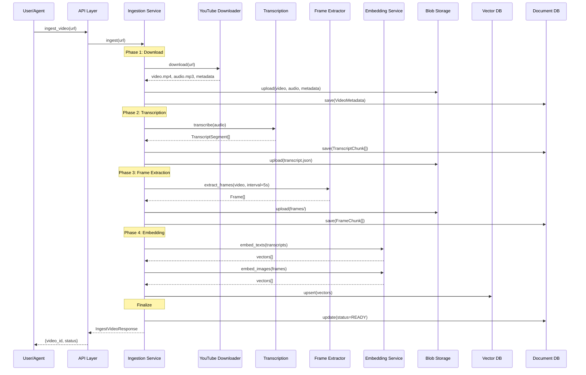
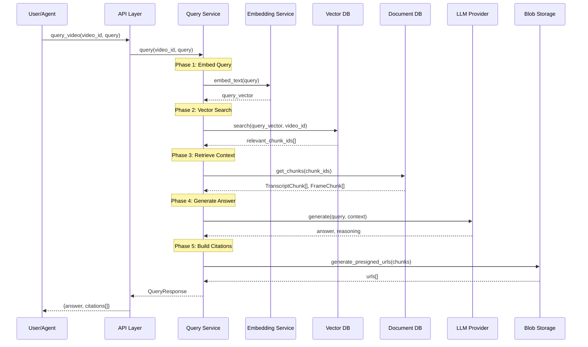

# Data Flow

This document describes how data flows through YouTube RAG Server during ingestion and query operations.

## Ingestion Flow

The ingestion pipeline processes a YouTube video into searchable chunks.



### Ingestion Phases

#### Phase 1: Download

```python
# Download video and audio
download_result = await youtube_downloader.download(url)

# Store raw files
await blob_storage.upload("videos", f"{video_id}/original.mp4", video_data)
await blob_storage.upload("videos", f"{video_id}/audio.mp3", audio_data)
await blob_storage.upload("videos", f"{video_id}/metadata.json", metadata)

# Create video record
video = VideoMetadata(
    youtube_id=download_result.youtube_id,
    title=download_result.title,
    duration_seconds=download_result.duration,
    status=VideoStatus.DOWNLOADING
)
await document_db.insert("videos", video)
```

#### Phase 2: Transcription

```python
# Transcribe audio with word timestamps
transcription = await transcription_service.transcribe(
    audio_path=audio_path,
    language_hint="en",
    word_timestamps=True
)

# Create transcript chunks with overlap
chunks = chunking_service.create_transcript_chunks(
    segments=transcription.segments,
    chunk_duration=30.0,
    overlap=5.0
)

# Store chunks
await document_db.insert_many("transcript_chunks", chunks)
```

#### Phase 3: Frame Extraction

```python
# Extract frames at intervals
frames = await frame_extractor.extract_frames(
    video_path=video_path,
    interval_seconds=5,
    output_format="jpg",
    generate_thumbnails=True
)

# Store frame files
for frame in frames:
    await blob_storage.upload("frames", f"{video_id}/full/{frame.number}.jpg", frame.data)
    await blob_storage.upload("frames", f"{video_id}/thumb/{frame.number}.jpg", frame.thumbnail)

# Create frame chunks
frame_chunks = [
    FrameChunk(
        video_id=video_id,
        frame_number=f.number,
        start_time=f.timestamp,
        blob_path=f"frames/{video_id}/full/{f.number}.jpg",
        thumbnail_path=f"frames/{video_id}/thumb/{f.number}.jpg"
    )
    for f in frames
]
await document_db.insert_many("frame_chunks", frame_chunks)
```

#### Phase 4: Embedding

```python
# Embed transcript chunks
transcript_texts = [chunk.text for chunk in transcript_chunks]
text_vectors = await embedding_service.embed_texts(transcript_texts)

# Embed frame chunks
frame_images = [await blob_storage.download(c.blob_path) for c in frame_chunks]
image_vectors = await embedding_service.embed_images(frame_images)

# Store in vector database
await vector_db.upsert(
    collection="transcript_embeddings",
    vectors=[
        {"id": chunk.id, "vector": vec, "metadata": {"video_id": video_id}}
        for chunk, vec in zip(transcript_chunks, text_vectors)
    ]
)

await vector_db.upsert(
    collection="frame_embeddings",
    vectors=[
        {"id": chunk.id, "vector": vec, "metadata": {"video_id": video_id}}
        for chunk, vec in zip(frame_chunks, image_vectors)
    ]
)
```

---

## Query Flow

The query pipeline retrieves relevant content and generates answers.



### Query Phases

#### Phase 1: Embed Query

```python
# Convert query to vector
query_vector = await embedding_service.embed_text(query)
```

#### Phase 2: Vector Search

```python
# Search transcript embeddings
transcript_results = await vector_db.search(
    collection="transcript_embeddings",
    vector=query_vector,
    filter={"video_id": video_id},
    top_k=10,
    score_threshold=0.7
)

# Search frame embeddings (for visual queries)
frame_results = await vector_db.search(
    collection="frame_embeddings",
    vector=query_vector,
    filter={"video_id": video_id},
    top_k=5,
    score_threshold=0.7
)
```

#### Phase 3: Retrieve Context

```python
# Get full chunk data
transcript_chunks = await document_db.find(
    "transcript_chunks",
    {"id": {"$in": [r.id for r in transcript_results]}}
)

frame_chunks = await document_db.find(
    "frame_chunks",
    {"id": {"$in": [r.id for r in frame_results]}}
)

# Build context string
context = build_context(transcript_chunks, frame_chunks)
```

#### Phase 4: Generate Answer

```python
# Generate answer with LLM
llm_response = await llm_service.generate(
    messages=[
        {"role": "system", "content": QUERY_SYSTEM_PROMPT},
        {"role": "user", "content": f"Context:\n{context}\n\nQuestion: {query}"}
    ],
    temperature=0.3
)

answer = llm_response.content
```

#### Phase 5: Build Citations

```python
# Create citations with presigned URLs
citations = []
for chunk, score in relevant_chunks:
    url = await blob_storage.generate_presigned_url(
        bucket="chunks" if isinstance(chunk, TranscriptChunk) else "frames",
        key=chunk.blob_path,
        expiry_seconds=3600
    )

    citations.append(SourceCitation(
        chunk_id=chunk.id,
        video_id=video_id,
        modality=chunk.modality,
        timestamp_range=TimestampRange(chunk.start_time, chunk.end_time),
        relevance_score=score,
        content_preview=chunk.text[:200] if hasattr(chunk, 'text') else None,
        source_urls={"primary": url}
    ))
```

---

## Data Storage Patterns

### Blob Storage Structure

```
buckets/
├── videos/
│   └── {video_id}/
│       ├── original.mp4
│       ├── audio.mp3
│       └── metadata.json
├── frames/
│   └── {video_id}/
│       ├── full/
│       │   ├── 0001.jpg
│       │   ├── 0002.jpg
│       │   └── ...
│       └── thumb/
│           ├── 0001.jpg
│           └── ...
├── chunks/
│   └── {video_id}/
│       ├── transcripts/
│       │   └── chunk_{n}.json
│       ├── audio/
│       │   └── chunk_{n}.mp3
│       └── video/
│           └── chunk_{n}.mp4
```

### Document DB Collections

```javascript
// videos collection
{
  "_id": "uuid",
  "youtube_id": "dQw4w9WgXcQ",
  "title": "...",
  "status": "ready",
  "blob_paths": { "video": "...", "audio": "..." },
  "chunk_counts": { "transcript": 42, "frame": 85 }
}

// transcript_chunks collection
{
  "_id": "uuid",
  "video_id": "uuid",
  "text": "...",
  "start_time": 30.5,
  "end_time": 60.0,
  "language": "en",
  "word_timestamps": [...]
}

// frame_chunks collection
{
  "_id": "uuid",
  "video_id": "uuid",
  "frame_number": 10,
  "start_time": 50.0,
  "blob_path": "frames/{video_id}/full/0010.jpg"
}
```

### Vector DB Collections

```python
# transcript_embeddings collection
{
    "id": "chunk_uuid",
    "vector": [0.1, 0.2, ...],  # 1536 dimensions
    "payload": {
        "video_id": "video_uuid",
        "start_time": 30.5,
        "end_time": 60.0,
        "modality": "transcript"
    }
}

# frame_embeddings collection
{
    "id": "chunk_uuid",
    "vector": [0.1, 0.2, ...],  # 512 dimensions (CLIP)
    "payload": {
        "video_id": "video_uuid",
        "timestamp": 50.0,
        "modality": "frame"
    }
}
```

---

## Error Handling

### Ingestion Errors

| Error Type | Handling | Result |
|------------|----------|--------|
| Download failure | Retry 3x with backoff | Status: FAILED |
| Transcription failure | Continue without transcript | Partial success |
| Frame extraction failure | Continue without frames | Partial success |
| Embedding failure | Retry individual chunks | Partial success |

### Query Errors

| Error Type | Handling | Result |
|------------|----------|--------|
| Vector search failure | Return error | 500 response |
| LLM failure | Return raw chunks | Degraded response |
| URL generation failure | Omit from citations | Partial citations |

## Next Steps

- [Design Principles](design-principles.md) - Error handling patterns
- [API Reference](../api/index.md) - API error responses
- [Infrastructure](../infrastructure/index.md) - Storage details
