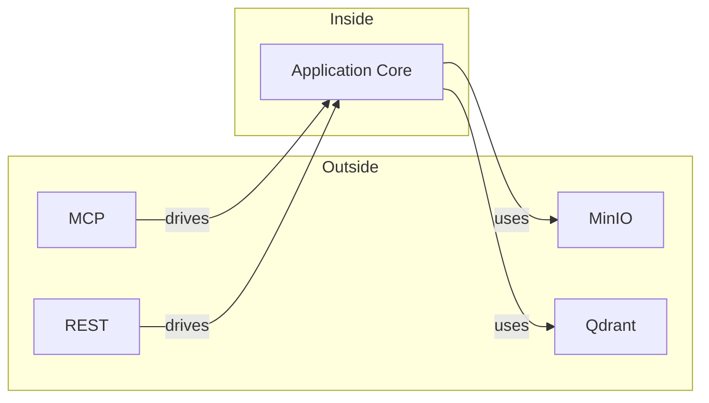

# Design Principles

Core architectural decisions and patterns used in YouTube RAG Server.

## 1. Dependency Inversion

> "High-level modules should not depend on low-level modules. Both should depend on abstractions."

### Implementation

All infrastructure components implement abstract base classes:

```python
# Abstraction (in commons)
class BlobStorageBase(ABC):
    @abstractmethod
    async def upload(self, bucket: str, key: str, data: bytes) -> str: ...

# Concrete implementation (in infrastructure)
class MinIOBlobStorage(BlobStorageBase):
    async def upload(self, bucket: str, key: str, data: bytes) -> str:
        # MinIO-specific implementation
        ...

# Application depends on abstraction
class VideoIngestionService:
    def __init__(self, blob_storage: BlobStorageBase):  # Not MinIOBlobStorage
        self._blob_storage = blob_storage
```

### Benefits

- **Testability**: Mock interfaces in unit tests
- **Flexibility**: Swap implementations without changing business logic
- **Decoupling**: Core logic doesn't know about infrastructure details

---

## 2. Hexagonal Architecture

> "The application is the center. It doesn't know how it's exposed or what stores its data."



### Ports & Adapters

| Type | Purpose | Example |
|------|---------|---------|
| **Driving Port** | How the app is called | `VideoIngestionService.ingest()` |
| **Driving Adapter** | Calls the app | MCP Server, REST Controller |
| **Driven Port** | What the app needs | `BlobStorageBase` |
| **Driven Adapter** | Implements needs | `MinIOBlobStorage` |

---

## 3. Cloud-Native Design

### Stateless Services

Application containers hold no state:

```python
# Good: State in external services
class QueryService:
    def __init__(self, vector_db: VectorDBBase, cache: CacheBase):
        self._vector_db = vector_db  # Qdrant
        self._cache = cache          # Redis

# Bad: State in application
class QueryService:
    def __init__(self):
        self._cache = {}  # In-memory state - lost on restart
```

### Configuration via Environment

```python
# Settings loaded from environment
class Settings:
    blob_storage: BlobStorageSettings
    vector_db: VectorDBSettings

# Environment variables override JSON config
# YOUTUBE_RAG__BLOB_STORAGE__PROVIDER=s3
```

### Horizontal Scalability

```yaml
# Kubernetes deployment
apiVersion: apps/v1
kind: Deployment
spec:
  replicas: 3  # Scale horizontally
  template:
    spec:
      containers:
      - name: youtube-rag
        resources:
          requests:
            cpu: "500m"
            memory: "512Mi"
```

---

## 4. Multimodal First

All data structures support multiple content types from the start.

### Unified Chunk Abstraction

```python
class ChunkModality(Enum):
    TRANSCRIPT = "transcript"
    FRAME = "frame"
    AUDIO = "audio"
    VIDEO = "video"

@dataclass
class BaseChunk(ABC):
    id: UUID
    video_id: UUID
    modality: ChunkModality
    start_time: float
    end_time: float

@dataclass
class TranscriptChunk(BaseChunk):
    text: str
    language: str
    word_timestamps: list[WordTimestamp]

@dataclass
class FrameChunk(BaseChunk):
    frame_number: int
    blob_path: str
    description: str | None
```

### Consistent Temporal Positioning

Every chunk type has temporal coordinates:

```python
# All chunks have start_time/end_time
transcript_chunk.start_time  # 30.5 seconds
frame_chunk.start_time       # 30.0 seconds
video_chunk.start_time       # 30.0 seconds

# Citations link back to time
citation = SourceCitation(
    timestamp_range=TimestampRange(start=30.0, end=60.0),
    youtube_url=f"https://youtube.com/watch?v={id}&t=30"
)
```

---

## 5. Fail-Safe Defaults

### Graceful Degradation

If a component fails, the system continues with reduced functionality:

```python
async def ingest(self, url: str) -> IngestVideoResponse:
    video = await self._download(url)

    # Transcription failure doesn't stop ingestion
    try:
        transcript = await self._transcribe(video.audio_path)
    except TranscriptionError as e:
        self._logger.warning(f"Transcription failed: {e}")
        transcript = None

    # Frame extraction failure doesn't stop ingestion
    try:
        frames = await self._extract_frames(video.video_path)
    except FrameExtractionError as e:
        self._logger.warning(f"Frame extraction failed: {e}")
        frames = []

    # Video is still queryable with partial content
    return IngestVideoResponse(
        video_id=video.id,
        has_transcript=transcript is not None,
        has_frames=len(frames) > 0
    )
```

### Retry with Backoff

```python
from tenacity import retry, stop_after_attempt, wait_exponential

@retry(
    stop=stop_after_attempt(3),
    wait=wait_exponential(multiplier=1, min=4, max=60)
)
async def download_with_retry(self, url: str) -> DownloadResult:
    return await self._downloader.download(url)
```

---

## 6. Single Responsibility

Each component has one job:

| Component | Responsibility |
|-----------|----------------|
| `YouTubeDownloader` | Download videos |
| `TranscriptionService` | Convert speech to text |
| `EmbeddingService` | Generate vectors |
| `ChunkingService` | Split content into chunks |
| `VideoIngestionService` | **Orchestrate** the above |

### Orchestration vs. Implementation

```python
# VideoIngestionService orchestrates, doesn't implement
class VideoIngestionService:
    async def ingest(self, url: str):
        # 1. Download (delegate to downloader)
        video = await self._downloader.download(url)

        # 2. Transcribe (delegate to transcription service)
        transcript = await self._transcription.transcribe(video.audio)

        # 3. Chunk (delegate to chunking service)
        chunks = await self._chunking.create_chunks(transcript)

        # 4. Embed (delegate to embedding service)
        vectors = await self._embedding.embed(chunks)

        # 5. Store (delegate to storage services)
        await self._store(video, chunks, vectors)
```

---

## 7. Explicit Over Implicit

### Type Hints Everywhere

```python
async def query(
    self,
    video_id: UUID,
    query: str,
    top_k: int = 10,
    modalities: list[ChunkModality] | None = None
) -> QueryResponse:
    ...
```

### Pydantic Validation

```python
class IngestVideoRequest(BaseModel):
    url: HttpUrl
    extract_frames: bool = True
    frame_interval_seconds: Annotated[int, Field(ge=1, le=60)] = 5
    language_hint: str | None = None

    @field_validator("url")
    @classmethod
    def validate_youtube_url(cls, v: HttpUrl) -> HttpUrl:
        if "youtube.com" not in str(v) and "youtu.be" not in str(v):
            raise ValueError("Must be a YouTube URL")
        return v
```

### Explicit Errors

```python
# Domain exceptions are specific
class VideoNotFoundException(DomainException):
    def __init__(self, video_id: UUID):
        super().__init__(f"Video not found: {video_id}")
        self.video_id = video_id

class VideoNotReadyException(DomainException):
    def __init__(self, video_id: UUID, current_status: VideoStatus):
        super().__init__(f"Video {video_id} is not ready: {current_status}")
        self.video_id = video_id
        self.current_status = current_status
```

---

## 8. Configuration Hierarchy

Settings are layered for flexibility:

```mermaid
graph TB
    A[appsettings.json<br/>Defaults] --> E[Final Config]
    B[appsettings.{env}.json<br/>Environment-specific] --> E
    C[Environment Variables<br/>Runtime overrides] --> E
    D[Kubernetes Secrets<br/>Sensitive values] --> E

    style E fill:#f9f,stroke:#333
```

### Priority (highest wins)

1. Environment variables
2. Environment-specific JSON
3. Base JSON defaults

```python
# Base: appsettings.json
{"blob_storage": {"provider": "minio", "endpoint": "localhost:9000"}}

# Dev: appsettings.dev.json
{"debug": true}

# Prod override via env var
YOUTUBE_RAG__BLOB_STORAGE__PROVIDER=s3
```

---

## Summary

| Principle | Implementation |
|-----------|----------------|
| Dependency Inversion | ABCs in commons, implementations in infrastructure |
| Hexagonal Architecture | Ports in application, adapters in api/infrastructure |
| Cloud-Native | Stateless services, external state, env config |
| Multimodal First | Unified chunk model, temporal positioning |
| Fail-Safe | Graceful degradation, retry with backoff |
| Single Responsibility | Services orchestrate, don't implement |
| Explicit | Type hints, Pydantic validation, specific exceptions |
| Configuration Hierarchy | JSON defaults → env overrides → secrets |

## Next Steps

- [Technology Stack](tech-stack.md) - Tools implementing these principles
- [Hexagonal Architecture](hexagonal.md) - Deep dive on ports & adapters
- [Configuration](../configuration/index.md) - Configuration system details
