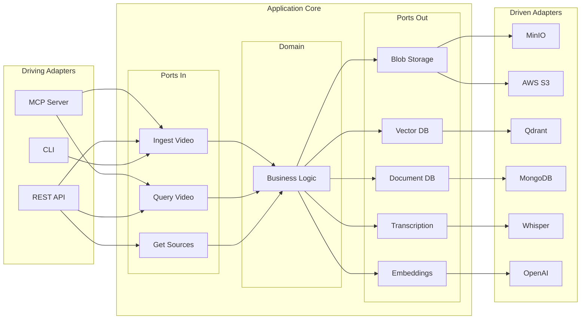
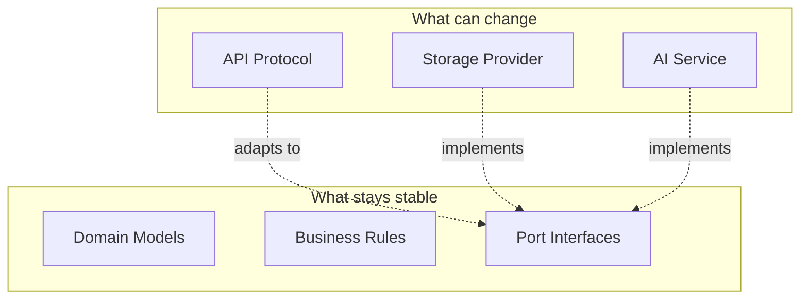

# Hexagonal Architecture

YouTube RAG Server implements the **Hexagonal Architecture** pattern (also known as Ports & Adapters), which isolates business logic from external concerns.

## Core Concept



## Ports (Interfaces)

Ports define **contracts** that the application core expects. They are abstract interfaces.

### Inbound Ports (Driving)

Inbound ports define how external actors can interact with the application.

```python
# src/application/services/ingestion.py
class VideoIngestionService:
    """Inbound port for video ingestion."""

    async def ingest(
        self,
        url: str,
        extract_frames: bool = True,
        language_hint: str | None = None
    ) -> IngestVideoResponse:
        """Ingest a YouTube video."""
        ...

    async def get_status(self, video_id: str) -> IngestionStatusResponse:
        """Get ingestion status."""
        ...
```

### Outbound Ports (Driven)

Outbound ports define what the application needs from external services.

```python
# src/commons/infrastructure/blob/base.py
class BlobStorageBase(ABC):
    """Outbound port for blob storage."""

    @abstractmethod
    async def upload(
        self,
        bucket: str,
        key: str,
        data: bytes,
        content_type: str | None = None
    ) -> str:
        """Upload a blob and return its URL."""
        ...

    @abstractmethod
    async def download(self, bucket: str, key: str) -> bytes:
        """Download a blob."""
        ...

    @abstractmethod
    async def generate_presigned_url(
        self,
        bucket: str,
        key: str,
        expiry_seconds: int = 3600
    ) -> str:
        """Generate a presigned URL for temporary access."""
        ...
```

## Adapters (Implementations)

Adapters are concrete implementations of ports.

### Driving Adapters

Driving adapters call into the application.

=== "MCP Server"

    ```python
    # src/api/mcp/server.py
    @mcp.tool()
    async def ingest_video(url: str) -> dict:
        """MCP adapter - calls inbound port."""
        service = get_ingestion_service()
        result = await service.ingest(url)
        return result.model_dump()
    ```

=== "REST API"

    ```python
    # src/api/openapi/routes/ingestion.py
    @router.post("/videos/ingest")
    async def ingest_video(
        request: IngestVideoRequest,
        service: VideoIngestionService = Depends(get_ingestion_service)
    ) -> IngestVideoResponse:
        """REST adapter - calls inbound port."""
        return await service.ingest(
            url=request.url,
            extract_frames=request.extract_frames
        )
    ```

### Driven Adapters

Driven adapters implement outbound ports.

=== "MinIO"

    ```python
    # src/commons/infrastructure/blob/minio_provider.py
    class MinIOBlobStorage(BlobStorageBase):
        """MinIO adapter implementing blob storage port."""

        def __init__(self, endpoint: str, access_key: str, secret_key: str):
            self._client = Minio(endpoint, access_key, secret_key)

        async def upload(self, bucket: str, key: str, data: bytes, ...) -> str:
            self._client.put_object(bucket, key, io.BytesIO(data), len(data))
            return f"{bucket}/{key}"
    ```

=== "S3"

    ```python
    # src/commons/infrastructure/blob/s3_provider.py
    class S3BlobStorage(BlobStorageBase):
        """AWS S3 adapter implementing blob storage port."""

        def __init__(self, region: str, access_key: str, secret_key: str):
            self._client = boto3.client('s3', region_name=region, ...)

        async def upload(self, bucket: str, key: str, data: bytes, ...) -> str:
            self._client.put_object(Bucket=bucket, Key=key, Body=data)
            return f"s3://{bucket}/{key}"
    ```

## Dependency Injection

The factory pattern connects ports to adapters based on configuration.

```python
# src/infrastructure/factory.py
class InfrastructureFactory:
    """Factory that creates adapters based on configuration."""

    def __init__(self, settings: Settings):
        self._settings = settings

    def create_blob_storage(self) -> BlobStorageBase:
        """Create blob storage adapter based on config."""
        provider = self._settings.blob_storage.provider

        if provider == "minio":
            return MinIOBlobStorage(
                endpoint=self._settings.blob_storage.endpoint,
                access_key=self._settings.blob_storage.access_key,
                secret_key=self._settings.blob_storage.secret_key
            )
        elif provider == "s3":
            return S3BlobStorage(
                region=self._settings.blob_storage.region,
                access_key=self._settings.blob_storage.access_key,
                secret_key=self._settings.blob_storage.secret_key
            )
        else:
            raise ValueError(f"Unknown blob provider: {provider}")
```

## Benefits

### 1. Testability

Test business logic without infrastructure.

```python
# tests/unit/application/test_ingestion.py
class MockBlobStorage(BlobStorageBase):
    """In-memory mock for testing."""

    def __init__(self):
        self._store = {}

    async def upload(self, bucket, key, data, **_):
        self._store[f"{bucket}/{key}"] = data
        return f"{bucket}/{key}"

def test_ingestion_stores_video():
    blob_storage = MockBlobStorage()
    service = VideoIngestionService(blob_storage=blob_storage, ...)

    result = await service.ingest("https://youtube.com/...")

    assert "videos/" in blob_storage._store
```

### 2. Swappable Providers

Change providers without touching business logic.

```yaml
# config/appsettings.dev.json
{
  "blob_storage": {
    "provider": "minio",
    "endpoint": "localhost:9000"
  }
}

# config/appsettings.prod.json
{
  "blob_storage": {
    "provider": "s3",
    "region": "us-east-1"
  }
}
```

### 3. Clear Boundaries

Each layer has explicit responsibilities.



### 4. Framework Independence

Core logic doesn't depend on FastAPI, MCP, or any framework.

```python
# Domain layer - zero dependencies
@dataclass
class VideoMetadata:
    id: UUID
    youtube_id: str
    title: str
    status: VideoStatus

# Can be used from any adapter
video = VideoMetadata(...)  # No FastAPI, no MCP
```

## Port Inventory

### Inbound Ports

| Port | Purpose | Adapters |
|------|---------|----------|
| `VideoIngestionService` | Ingest videos | MCP, REST |
| `QueryService` | Query videos | MCP, REST |
| `SourceRetrievalService` | Get sources | REST |
| `VideoManagementService` | CRUD operations | REST |

### Outbound Ports

| Port | Purpose | Adapters |
|------|---------|----------|
| `BlobStorageBase` | File storage | MinIO, S3, GCS, Azure |
| `VectorDBBase` | Vector search | Qdrant, Pinecone, Weaviate |
| `DocumentDBBase` | Document storage | MongoDB, PostgreSQL |
| `TranscriptionServiceBase` | Speech-to-text | Whisper, Deepgram |
| `EmbeddingServiceBase` | Embeddings | OpenAI, CLIP, Cohere |
| `LLMServiceBase` | Language model | OpenAI, Anthropic |

## Next Steps

- [Data Flow](data-flow.md) - See how data moves through ports
- [Adding Providers](../infrastructure/adding-providers.md) - Implement new adapters
- [Design Principles](design-principles.md) - More architectural patterns
