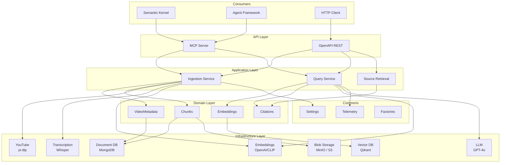

# Architecture

YouTube RAG Server follows a **layered hexagonal architecture** designed for testability, extensibility, and cloud-native deployment.

## Quick Navigation

-   :material-chart-box:{ .lg .middle } __System Overview__

    ---

    High-level view of the system components

    [:octicons-arrow-right-24: Overview](system-overview.md)

-   :material-hexagon-multiple:{ .lg .middle } __Hexagonal Architecture__

    ---

    Ports & Adapters pattern implementation

    [:octicons-arrow-right-24: Hexagonal](hexagonal.md)

-   :material-transit-connection-variant:{ .lg .middle } __Data Flow__

    ---

    How data moves through the system

    [:octicons-arrow-right-24: Data Flow](data-flow.md)

-   :material-check-decagram:{ .lg .middle } __Design Principles__

    ---

    Core architectural decisions

    [:octicons-arrow-right-24: Principles](design-principles.md)

-   :material-layers:{ .lg .middle } __Technology Stack__

    ---

    Languages, frameworks, and services

    [:octicons-arrow-right-24: Tech Stack](tech-stack.md)

## Architecture at a Glance

## Layer Summary

| Layer | Purpose | Key Components |
|-------|---------|----------------|
| **API** | External exposure | MCP Server, REST API |
| **Application** | Business orchestration | Ingestion, Query, Source Retrieval |
| **Domain** | Business entities | Video, Chunks, Embeddings, Citations |
| **Infrastructure** | External services | Storage, AI Services, YouTube |
| **Commons** | Shared utilities | Settings, Telemetry, Factories |

## Key Characteristics

### Separation of Concerns
Each layer has a single responsibility and well-defined interfaces.

### Dependency Inversion
Higher layers depend on abstractions, not concrete implementations.

### Testability
Core logic can be tested without infrastructure dependencies.

### Extensibility
New providers can be added without changing business logic.

### Cloud-Native
Stateless services, external state, configuration via environment.
