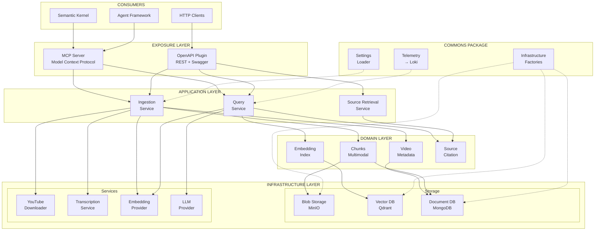
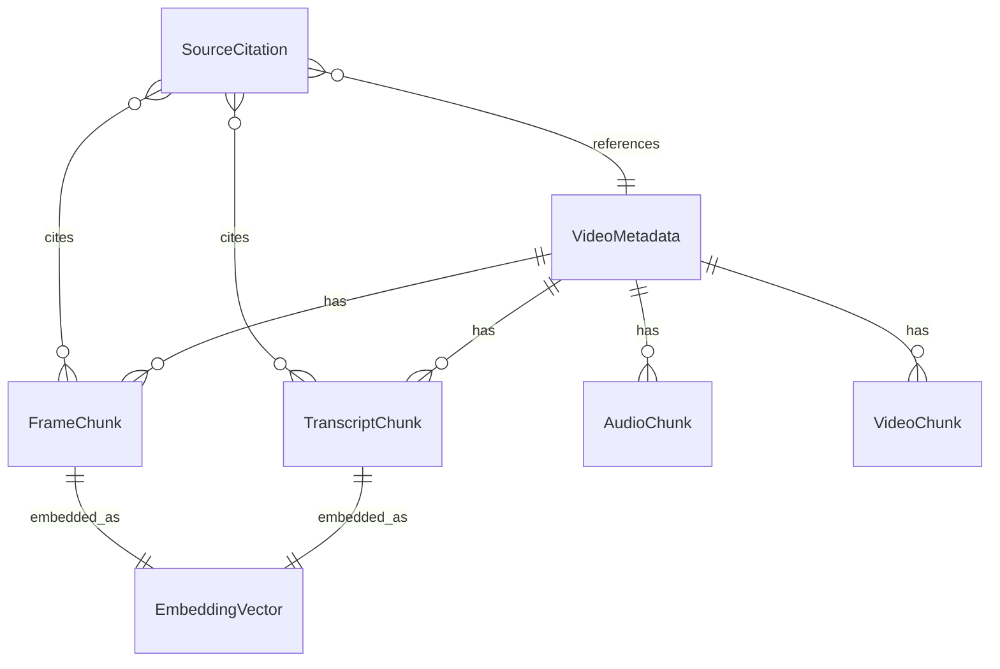

# System Overview

This document provides a detailed view of the YouTube RAG Server architecture and its components.

## Full Architecture Diagram



## Layer Descriptions

### 1. Exposure Layer

The topmost layer that exposes the system's capabilities to external consumers.

#### MCP Server

- Implements the **Model Context Protocol** for AI agent integration
- Exposes tools that agents can discover and invoke
- Handles MCP-specific protocol concerns (capability negotiation, tool schemas)

```python
# Example MCP tool registration
@mcp.tool()
async def ingest_video(url: str, extract_frames: bool = True) -> dict:
    """Ingest a YouTube video for semantic search."""
    return await ingestion_service.ingest(url, extract_frames)
```

#### OpenAPI Plugin

- **RESTful API** for direct HTTP integration
- OpenAPI 3.0 specification for documentation and client generation
- Can be used as a ChatGPT/Copilot plugin

### 2. Application Layer

Contains business logic orchestration without knowing about external protocols.

#### Ingestion Service

| Responsibility | Description |
|----------------|-------------|
| **Orchestration** | Coordinates the full video ingestion pipeline |
| **Pipeline** | Download → Transcription → Frame extraction → Embedding |
| **Status** | Manages video status transitions |
| **Resilience** | Handles failures and retries |

#### Query Service

| Responsibility | Description |
|----------------|-------------|
| **Processing** | Semantic queries against indexed videos |
| **Pipeline** | Embedding → Vector search → Context retrieval → LLM |
| **Citations** | Builds citation metadata for responses |

#### Source Retrieval Service

| Responsibility | Description |
|----------------|-------------|
| **URL Generation** | Creates presigned URLs for source artifacts |
| **Multimodal Access** | Handles transcript, frame, audio, video retrieval |
| **Citation Resolution** | Maps citations to source files |

### 3. Domain Layer

Pure business entities and logic, free from infrastructure concerns.



| Entity | Purpose |
|--------|---------|
| **VideoMetadata** | Core entity representing an indexed YouTube video |
| **Chunk** | Indexed segments (Transcript, Frame, Audio, Video) |
| **EmbeddingVector** | Vector representations for semantic search |
| **SourceCitation** | Citable source in query responses |

### 4. Infrastructure Layer

Concrete implementations of external services and storage.

#### Storage Components

| Component | Technology | Purpose |
|-----------|------------|---------|
| **Blob Storage** | MinIO (dev), S3 (prod) | Raw files (video, audio, frames, JSON) |
| **Vector DB** | Qdrant | Embedding vectors for semantic search |
| **Document DB** | MongoDB | Metadata, chunks, citations |

#### External Services

| Service | Technology | Purpose |
|---------|------------|---------|
| **YouTube Downloader** | yt-dlp | Video acquisition |
| **Transcription** | OpenAI Whisper | Speech-to-text |
| **Embeddings** | OpenAI, CLIP | Text and image embeddings |
| **LLM** | GPT-4o | Query answering |

### 5. Commons Package

Shared utilities designed for potential extraction to a separate repository.

#### Settings Loader

- Hierarchical configuration loading
- Environment-aware (dev/staging/prod)
- Pydantic-based validation

#### Telemetry

- Structured logging with correlation IDs
- Decorators for tracing and exception logging
- Loki-compatible output format

#### Infrastructure Factories

- Abstract base classes for all components
- Factory pattern for provider instantiation

## Package Structure

```
youtube-rag-server/
├── src/
│   ├── commons/              # Shared utilities
│   │   ├── settings/         # Configuration
│   │   ├── telemetry/        # Logging & tracing
│   │   └── infrastructure/   # ABCs & factories
│   │
│   ├── domain/               # Business entities
│   │   ├── models/           # Video, Chunk, Embedding, Citation
│   │   ├── value_objects/    # YouTubeVideoId, ChunkingConfig
│   │   └── exceptions.py     # Domain exceptions
│   │
│   ├── application/          # Business logic
│   │   ├── services/         # Ingestion, Query, Source Retrieval
│   │   ├── pipelines/        # Processing workflows
│   │   └── dtos/             # Request/Response objects
│   │
│   ├── infrastructure/       # External implementations
│   │   ├── youtube/          # yt-dlp wrapper
│   │   ├── transcription/    # Whisper
│   │   ├── embeddings/       # OpenAI, CLIP
│   │   ├── llm/              # GPT-4o
│   │   └── video/            # FFmpeg tools
│   │
│   └── api/                  # Exposure layer
│       ├── mcp/              # MCP server
│       └── openapi/          # REST routes
│
├── tests/
│   ├── unit/
│   ├── integration/
│   └── e2e/
│
├── config/                   # Configuration files
├── k8s/                      # Kubernetes manifests
└── docs/                     # Documentation
```

## Next Steps

- [Hexagonal Architecture](hexagonal.md) - Deep dive into Ports & Adapters
- [Data Flow](data-flow.md) - Understand how data moves
- [Design Principles](design-principles.md) - Core architectural decisions
