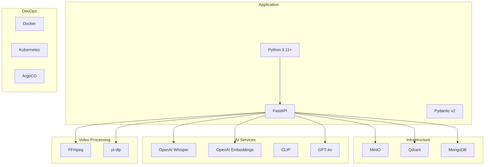

# Technology Stack

Complete overview of languages, frameworks, and services used in YouTube RAG Server.

## Stack Overview



## Core Application

| Component | Technology | Version | Purpose |
|-----------|-----------|---------|---------|
| **Language** | Python | 3.11+ | Main application language |
| **API Framework** | FastAPI | 0.115+ | REST API with async support |
| **Validation** | Pydantic | 2.0+ | Data validation and settings |
| **Async** | asyncio | stdlib | Asynchronous I/O |
| **HTTP Client** | httpx | 0.28+ | Async HTTP requests |

### Why Python 3.11+?

- **Performance**: 10-60% faster than 3.10
- **Type hints**: Full `Self` type, `TypeVarTuple`
- **Exception groups**: Better error handling
- **asyncio**: Task groups for concurrent operations

### Why FastAPI?

- **Async native**: Built on Starlette
- **Type-safe**: Pydantic integration
- **OpenAPI**: Automatic documentation
- **Performance**: One of the fastest Python frameworks

---

## Storage Layer

### Blob Storage

| Provider | Use Case | Features |
|----------|----------|----------|
| **MinIO** | Development | S3-compatible, self-hosted |
| **AWS S3** | Production | Scalable, durable |
| **GCS** | Alternative | Google Cloud integration |
| **Azure Blob** | Alternative | Azure integration |

```yaml
# Development: MinIO
blob_storage:
  provider: minio
  endpoint: localhost:9000
  access_key: minioadmin
  secret_key: minioadmin

# Production: S3
blob_storage:
  provider: s3
  region: us-east-1
  access_key: ${AWS_ACCESS_KEY_ID}
  secret_key: ${AWS_SECRET_ACCESS_KEY}
```

### Vector Database

| Provider | Dimensions | Features |
|----------|------------|----------|
| **Qdrant** | Any | Default, self-hosted or cloud |
| **Pinecone** | Any | Managed, serverless |
| **Weaviate** | Any | GraphQL API |

**Why Qdrant?**

- High performance similarity search
- Filtering during search
- Self-hosted or cloud options
- Active development

```python
# Qdrant collection setup
await qdrant.create_collection(
    collection_name="transcript_embeddings",
    vectors_config=VectorParams(
        size=1536,  # OpenAI dimensions
        distance=Distance.COSINE
    )
)
```

### Document Database

| Provider | Features |
|----------|----------|
| **MongoDB** | Default, flexible schema |
| **PostgreSQL** | Alternative, ACID compliance |

**Why MongoDB?**

- Flexible document schema
- Good for varied chunk structures
- Async driver (motor)
- Horizontal scaling

---

## AI Services

### Transcription

| Provider | Model | Features |
|----------|-------|----------|
| **OpenAI Whisper** | whisper-1 | Default, word timestamps |
| **Deepgram** | nova-2 | Fast, streaming |
| **AssemblyAI** | universal | Speaker diarization |

```python
# OpenAI Whisper usage
response = await openai.audio.transcriptions.create(
    model="whisper-1",
    file=audio_file,
    response_format="verbose_json",
    timestamp_granularities=["word"]
)
```

### Text Embeddings

| Provider | Model | Dimensions |
|----------|-------|------------|
| **OpenAI** | text-embedding-3-small | 1536 |
| **OpenAI** | text-embedding-3-large | 3072 |
| **Cohere** | embed-english-v3.0 | 1024 |

```python
# OpenAI embeddings
response = await openai.embeddings.create(
    model="text-embedding-3-small",
    input=texts
)
vectors = [e.embedding for e in response.data]
```

### Image Embeddings

| Provider | Model | Dimensions |
|----------|-------|------------|
| **CLIP** | ViT-B/32 | 512 |
| **CLIP** | ViT-L/14 | 768 |

```python
# CLIP embeddings (local)
from transformers import CLIPProcessor, CLIPModel

model = CLIPModel.from_pretrained("openai/clip-vit-base-patch32")
processor = CLIPProcessor.from_pretrained("openai/clip-vit-base-patch32")

inputs = processor(images=images, return_tensors="pt")
vectors = model.get_image_features(**inputs)
```

### LLM

| Provider | Model | Context | Features |
|----------|-------|---------|----------|
| **OpenAI** | gpt-4o | 128K | Default, vision |
| **OpenAI** | gpt-4o-mini | 128K | Cost-effective |
| **Anthropic** | claude-3.5-sonnet | 200K | Alternative |

---

## Video Processing

### FFmpeg

Video and audio manipulation:

```python
import ffmpeg

# Extract frames
ffmpeg.input(video_path) \
    .filter('fps', fps=1/interval) \
    .output(f'{output_dir}/frame_%04d.jpg') \
    .run()

# Extract audio
ffmpeg.input(video_path) \
    .output(audio_path, acodec='mp3', audio_bitrate='128k') \
    .run()

# Chunk video
ffmpeg.input(video_path) \
    .output(chunk_path, ss=start, t=duration, c='copy') \
    .run()
```

### yt-dlp

YouTube video downloading:

```python
import yt_dlp

ydl_opts = {
    'format': 'bestvideo[height<=1080]+bestaudio/best',
    'outtmpl': '%(id)s.%(ext)s',
    'writeinfojson': True,
    'writethumbnail': True,
}

with yt_dlp.YoutubeDL(ydl_opts) as ydl:
    info = ydl.extract_info(url, download=True)
```

---

## Development Tools

### Code Quality

| Tool | Purpose | Config |
|------|---------|--------|
| **Ruff** | Linting + Formatting | `pyproject.toml` |
| **Mypy** | Type checking | `pyproject.toml` |
| **Pre-commit** | Git hooks | `.pre-commit-config.yaml` |

```toml
# pyproject.toml
[tool.ruff]
target-version = "py311"
line-length = 88

[tool.mypy]
python_version = "3.11"
strict = true
```

### Testing

| Tool | Purpose |
|------|---------|
| **pytest** | Test framework |
| **pytest-asyncio** | Async test support |
| **pytest-cov** | Coverage reporting |

```bash
# Run tests
pytest

# With coverage
pytest --cov=src --cov-report=html

# Specific markers
pytest -m unit
pytest -m integration
```

---

## Infrastructure

### Docker

```dockerfile
FROM python:3.11-slim

# Install system dependencies
RUN apt-get update && apt-get install -y ffmpeg

# Install Python dependencies
COPY pyproject.toml .
RUN pip install uv && uv sync --frozen

# Copy application
COPY src/ src/

CMD ["uvicorn", "src.api.main:app", "--host", "0.0.0.0"]
```

### Docker Compose

```yaml
version: '3.8'
services:
  minio:
    image: minio/minio
    ports:
      - "9000:9000"
      - "9001:9001"
    command: server /data --console-address ":9001"

  qdrant:
    image: qdrant/qdrant
    ports:
      - "6333:6333"
      - "6334:6334"

  mongodb:
    image: mongo:7
    ports:
      - "27017:27017"
```

### Kubernetes

```yaml
apiVersion: apps/v1
kind: Deployment
metadata:
  name: youtube-rag-server
spec:
  replicas: 3
  template:
    spec:
      containers:
      - name: app
        image: youtube-rag-server:latest
        resources:
          requests:
            cpu: "500m"
            memory: "1Gi"
        env:
        - name: YOUTUBE_RAG__APP__ENVIRONMENT
          value: "prod"
```

---

## Observability

### Logging

| Component | Technology |
|-----------|------------|
| **Format** | Structured JSON |
| **Aggregation** | Loki |
| **Visualization** | Grafana |

```python
# Structured logging
logger.info(
    "Video ingested",
    extra={
        "video_id": str(video_id),
        "duration_seconds": duration,
        "chunk_count": len(chunks)
    }
)
```

### Metrics (Future)

| Metric | Type |
|--------|------|
| Ingestion duration | Histogram |
| Query latency | Histogram |
| Active videos | Gauge |
| Error rate | Counter |

---

## Version Summary

```toml
# pyproject.toml dependencies
[project]
requires-python = ">=3.11"
dependencies = [
    "pydantic>=2.0",
    "pydantic-settings>=2.0",
    "fastapi>=0.115.0",
    "uvicorn[standard]>=0.32.0",
    "minio>=7.2.0",
    "qdrant-client>=1.12.0",
    "motor>=3.6.0",
    "yt-dlp>=2024.11.0",
    "openai>=1.55.0",
    "httpx>=0.28.0",
    "ffmpeg-python>=0.2.0",
    "pillow>=11.0.0",
    "aiofiles>=24.1.0",
    "tenacity>=9.0.0",
]
```

## Next Steps

- [Installation](../getting-started/installation.md) - Set up the stack
- [Configuration](../configuration/index.md) - Configure providers
- [Development](../development/index.md) - Development workflow
