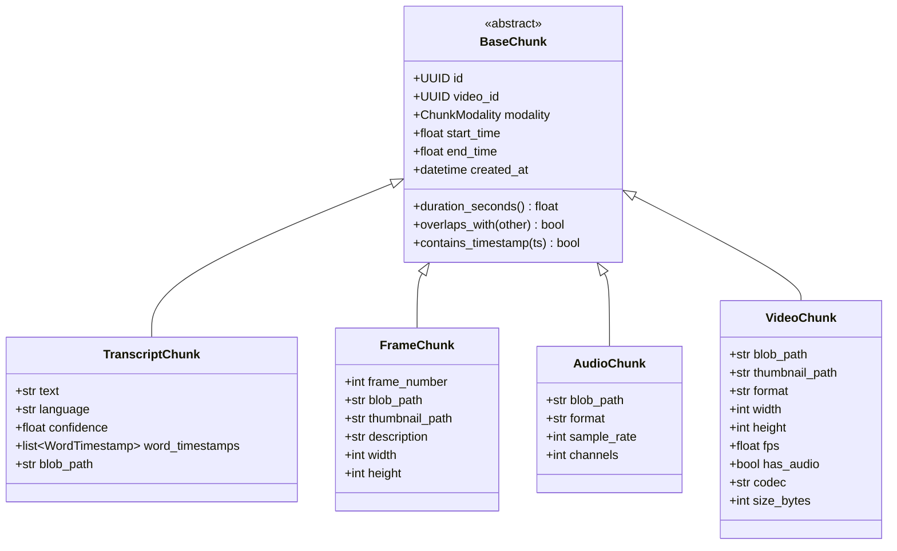

# Chunks

Chunks represent indexed segments of video content. Each chunk has temporal positioning (start/end times) and modality-specific data.

## Overview



## Chunk Modality

```python
from enum import Enum

class ChunkModality(str, Enum):
    """Content modality type."""
    TRANSCRIPT = "transcript"
    FRAME = "frame"
    AUDIO = "audio"
    VIDEO = "video"
```

## Base Chunk

All chunk types inherit from `BaseChunk`:

```python
from abc import ABC
from datetime import datetime
from uuid import UUID
from pydantic import BaseModel, Field


class BaseChunk(BaseModel, ABC):
    """Abstract base class for all chunk types."""

    id: UUID = Field(description="Unique chunk identifier")
    video_id: UUID = Field(description="Reference to parent VideoMetadata")
    modality: ChunkModality = Field(description="Type of content")
    start_time: float = Field(description="Start time in seconds")
    end_time: float = Field(description="End time in seconds")
    created_at: datetime = Field(description="When this chunk was created")

    def duration_seconds(self) -> float:
        """Calculate chunk duration."""
        return self.end_time - self.start_time

    def overlaps_with(self, other: "BaseChunk") -> bool:
        """Check if this chunk overlaps temporally with another."""
        return not (
            self.end_time <= other.start_time or
            self.start_time >= other.end_time
        )

    def contains_timestamp(self, timestamp: float) -> bool:
        """Check if a timestamp falls within this chunk."""
        return self.start_time <= timestamp < self.end_time
```

---

## TranscriptChunk

Represents a segment of transcribed speech with word-level timestamps.

### Model

```python
class WordTimestamp(BaseModel):
    """Individual word with precise timing."""
    word: str
    start_time: float
    end_time: float
    confidence: float = Field(ge=0.0, le=1.0)


class TranscriptChunk(BaseChunk):
    """A segment of transcribed speech."""

    modality: ChunkModality = ChunkModality.TRANSCRIPT

    text: str = Field(description="Transcribed text content")
    language: str = Field(description="Detected language (ISO 639-1)")
    confidence: float = Field(ge=0.0, le=1.0, description="Transcription confidence")
    word_timestamps: list[WordTimestamp] = Field(default_factory=list)
    blob_path: str | None = Field(default=None, description="Path to detailed JSON")

    def get_text_at_timestamp(self, timestamp: float) -> str | None:
        """Get the word being spoken at a specific timestamp."""
        for word in self.word_timestamps:
            if word.start_time <= timestamp < word.end_time:
                return word.word
        return None

    def get_text_in_range(self, start: float, end: float) -> str:
        """Get text spoken within a time range."""
        words = [
            w.word for w in self.word_timestamps
            if w.start_time >= start and w.end_time <= end
        ]
        return " ".join(words)
```

### Example

```python
transcript = TranscriptChunk(
    id=uuid4(),
    video_id=video.id,
    start_time=30.0,
    end_time=60.0,
    created_at=datetime.utcnow(),
    text="We're no strangers to love. You know the rules and so do I.",
    language="en",
    confidence=0.95,
    word_timestamps=[
        WordTimestamp(word="We're", start_time=30.0, end_time=30.3, confidence=0.98),
        WordTimestamp(word="no", start_time=30.3, end_time=30.5, confidence=0.99),
        # ... more words
    ]
)

# Get word at specific time
word = transcript.get_text_at_timestamp(30.2)  # "We're"
```

---

## FrameChunk

Represents a single video frame extracted for visual analysis.

### Model

```python
class FrameChunk(BaseChunk):
    """A single video frame extracted for visual analysis."""

    modality: ChunkModality = ChunkModality.FRAME

    frame_number: int = Field(description="Sequential frame number")
    blob_path: str = Field(description="Path to full-resolution image")
    thumbnail_path: str = Field(description="Path to thumbnail")
    description: str | None = Field(default=None, description="AI-generated description")
    width: int = Field(description="Frame width in pixels")
    height: int = Field(description="Frame height in pixels")

    @property
    def aspect_ratio(self) -> float:
        """Calculate aspect ratio."""
        return self.width / self.height if self.height > 0 else 0
```

### Example

```python
frame = FrameChunk(
    id=uuid4(),
    video_id=video.id,
    start_time=45.0,
    end_time=45.0,  # Single point in time for frames
    created_at=datetime.utcnow(),
    frame_number=9,
    blob_path="frames/dQw4w9WgXcQ/full/0009.jpg",
    thumbnail_path="frames/dQw4w9WgXcQ/thumb/0009.jpg",
    description="Man in trench coat singing in warehouse",
    width=1920,
    height=1080
)

print(f"Aspect ratio: {frame.aspect_ratio:.2f}")  # 1.78
```

---

## AudioChunk

Represents a segment of audio for acoustic analysis.

### Model

```python
class AudioChunk(BaseChunk):
    """A segment of audio for acoustic analysis."""

    modality: ChunkModality = ChunkModality.AUDIO

    blob_path: str = Field(description="Path to audio segment")
    format: str = Field(default="mp3", description="Audio format")
    sample_rate: int = Field(default=44100, description="Sample rate in Hz")
    channels: int = Field(default=1, description="Number of audio channels")
```

### Example

```python
audio = AudioChunk(
    id=uuid4(),
    video_id=video.id,
    start_time=0.0,
    end_time=60.0,
    created_at=datetime.utcnow(),
    blob_path="chunks/dQw4w9WgXcQ/audio/chunk_001.mp3",
    format="mp3",
    sample_rate=44100,
    channels=2
)
```

---

## VideoChunk

Represents a video segment for multimodal LLM analysis.

### Model

```python
class VideoChunk(BaseChunk):
    """A segment of video for multimodal LLM analysis."""

    modality: ChunkModality = ChunkModality.VIDEO

    blob_path: str = Field(description="Path to video segment")
    thumbnail_path: str = Field(description="Path to representative thumbnail")
    format: str = Field(default="mp4", description="Video format")
    width: int = Field(description="Video width in pixels")
    height: int = Field(description="Video height in pixels")
    fps: float = Field(description="Frames per second")
    has_audio: bool = Field(default=True, description="Includes audio track")
    codec: str = Field(default="h264", description="Video codec")
    size_bytes: int = Field(description="File size in bytes")
    description: str | None = Field(default=None, description="AI-generated description")

    @property
    def aspect_ratio(self) -> float:
        return self.width / self.height if self.height > 0 else 0

    @property
    def size_mb(self) -> float:
        """Get size in megabytes."""
        return self.size_bytes / (1024 * 1024)

    def is_within_size_limit(self, max_mb: float = 20.0) -> bool:
        """Check if chunk is within API size limits."""
        return self.size_mb <= max_mb
```

### Example

```python
video_chunk = VideoChunk(
    id=uuid4(),
    video_id=video.id,
    start_time=30.0,
    end_time=60.0,
    created_at=datetime.utcnow(),
    blob_path="chunks/dQw4w9WgXcQ/video/chunk_002.mp4",
    thumbnail_path="chunks/dQw4w9WgXcQ/video/chunk_002_thumb.jpg",
    format="mp4",
    width=1920,
    height=1080,
    fps=30.0,
    has_audio=True,
    codec="h264",
    size_bytes=15_000_000  # 15 MB
)

# Check if suitable for API
if video_chunk.is_within_size_limit(20.0):
    await send_to_multimodal_llm(video_chunk)
```

---

## Multimodal LLM Compatibility

VideoChunks are designed for multimodal LLMs:

| Provider | Model | Max Size | Max Duration |
|----------|-------|----------|--------------|
| Google | Gemini 1.5 Pro | 2 GB | 1 hour |
| Google | Gemini 1.5 Flash | 2 GB | 1 hour |
| OpenAI | GPT-4o | TBD | TBD |
| Anthropic | Claude | TBD | TBD |

---

## Storage

### MongoDB Structure

```javascript
// Collection: transcript_chunks
{
  "_id": "uuid",
  "video_id": "uuid",
  "modality": "transcript",
  "start_time": 30.0,
  "end_time": 60.0,
  "text": "We're no strangers to love...",
  "language": "en",
  "confidence": 0.95,
  "word_timestamps": [
    {"word": "We're", "start_time": 30.0, "end_time": 30.3, "confidence": 0.98}
  ],
  "blob_path": "chunks/dQw4w9WgXcQ/transcripts/chunk_001.json"
}

// Collection: frame_chunks
{
  "_id": "uuid",
  "video_id": "uuid",
  "modality": "frame",
  "start_time": 45.0,
  "end_time": 45.0,
  "frame_number": 9,
  "blob_path": "frames/dQw4w9WgXcQ/full/0009.jpg",
  "thumbnail_path": "frames/dQw4w9WgXcQ/thumb/0009.jpg",
  "width": 1920,
  "height": 1080
}
```

### Blob Storage Structure

```
buckets/
├── frames/
│   └── {video_id}/
│       ├── full/
│       │   └── 0001.jpg, 0002.jpg, ...
│       └── thumb/
│           └── 0001.jpg, 0002.jpg, ...
├── chunks/
│   └── {video_id}/
│       ├── transcripts/
│       │   └── chunk_001.json, ...
│       ├── audio/
│       │   └── chunk_001.mp3, ...
│       └── video/
│           └── chunk_001.mp4, ...
```

---

## Chunking Configuration

Control how chunks are created:

```python
class ChunkingConfig(BaseModel):
    """Configuration for chunk generation."""

    # Transcript chunks
    transcript_chunk_seconds: int = 30
    transcript_overlap_seconds: int = 5

    # Frame extraction
    frame_interval_seconds: float = 2.0

    # Audio chunks
    audio_chunk_seconds: int = 60

    # Video chunks
    video_chunk_seconds: int = 30
    video_chunk_overlap_seconds: int = 2
    video_chunk_max_size_mb: float = 20.0
```

See [Value Objects](value-objects.md) for details.

## Related

- [VideoMetadata](video-metadata.md) - Parent entity
- [Embeddings](embeddings.md) - Vector representations
- [Value Objects](value-objects.md) - ChunkingConfig
