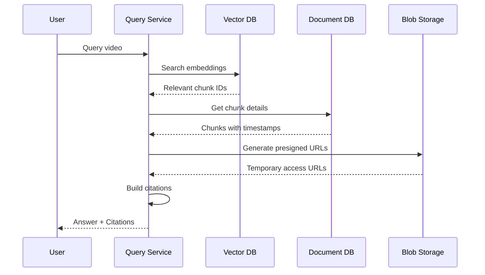

# Citations

Source references generated during query responses, providing verifiable links back to original video content.

## Model Definitions

### TimestampRange

```python
from pydantic import BaseModel, Field


class TimestampRange(BaseModel):
    """A time range within a video."""

    start_time: float = Field(ge=0, description="Start time in seconds")
    end_time: float = Field(ge=0, description="End time in seconds")

    def duration_seconds(self) -> float:
        """Get duration of this range."""
        return self.end_time - self.start_time

    def format_display(self) -> str:
        """Format as MM:SS - MM:SS for display."""
        def fmt(s: float) -> str:
            minutes = int(s // 60)
            seconds = int(s % 60)
            return f"{minutes:02d}:{seconds:02d}"
        return f"{fmt(self.start_time)} - {fmt(self.end_time)}"

    def to_youtube_url_param(self) -> str:
        """Generate YouTube timestamp parameter."""
        return f"t={int(self.start_time)}"
```

### SourceCitation

```python
from uuid import UUID


class SourceCitation(BaseModel):
    """
    A citation pointing to source material in a video.

    Citations are generated during query responses to provide
    verifiable references to the original content.
    """

    id: UUID = Field(description="Unique citation identifier")
    video_id: UUID = Field(description="Reference to source video")
    chunk_ids: list[UUID] = Field(description="Chunks supporting this citation")
    modality: ChunkModality = Field(description="Primary modality of cited content")
    timestamp_range: TimestampRange = Field(description="Temporal location in video")
    relevance_score: float = Field(ge=0.0, le=1.0, description="Relevance to query")
    content_preview: str = Field(description="Short preview of cited content")
    source_urls: dict[str, str] = Field(
        default_factory=dict,
        description="Presigned URLs for accessing sources by modality"
    )

    def youtube_url_with_timestamp(self, base_url: str) -> str:
        """Generate YouTube URL that jumps to this citation."""
        param = self.timestamp_range.to_youtube_url_param()
        separator = "&" if "?" in base_url else "?"
        return f"{base_url}{separator}{param}"
```

## Citation Flow



## Example

### Creating a Citation

```python
from uuid import uuid4

citation = SourceCitation(
    id=uuid4(),
    video_id=video.id,
    chunk_ids=[chunk1.id, chunk2.id],
    modality=ChunkModality.TRANSCRIPT,
    timestamp_range=TimestampRange(start_time=30.0, end_time=60.0),
    relevance_score=0.92,
    content_preview="We're no strangers to love. You know the rules...",
    source_urls={
        "transcript": "https://storage.example.com/...",
        "video": "https://storage.example.com/...",
    }
)

# Format for display
print(citation.timestamp_range.format_display())  # "00:30 - 01:00"

# Get YouTube link
youtube_url = citation.youtube_url_with_timestamp(
    "https://www.youtube.com/watch?v=dQw4w9WgXcQ"
)
# "https://www.youtube.com/watch?v=dQw4w9WgXcQ&t=30"
```

### Citation in Query Response

```python
class QueryResponse(BaseModel):
    """Response to a video query."""

    answer: str
    citations: list[SourceCitation]
    confidence: float
    processing_time_ms: int


response = QueryResponse(
    answer="The video discusses the concept of never giving up on love...",
    citations=[
        SourceCitation(
            id=uuid4(),
            video_id=video.id,
            chunk_ids=[chunk.id],
            modality=ChunkModality.TRANSCRIPT,
            timestamp_range=TimestampRange(start_time=0.0, end_time=30.0),
            relevance_score=0.95,
            content_preview="We're no strangers to love...",
            source_urls={
                "transcript": presigned_url,
                "youtube": "https://youtube.com/watch?v=dQw4w9WgXcQ&t=0"
            }
        ),
        SourceCitation(
            id=uuid4(),
            video_id=video.id,
            chunk_ids=[frame_chunk.id],
            modality=ChunkModality.FRAME,
            timestamp_range=TimestampRange(start_time=45.0, end_time=45.0),
            relevance_score=0.87,
            content_preview="[Frame showing singer in warehouse]",
            source_urls={
                "frame": frame_presigned_url,
                "thumbnail": thumbnail_presigned_url
            }
        )
    ],
    confidence=0.91,
    processing_time_ms=1234
)
```

## Source URLs

Citations include presigned URLs for accessing source material:

| Modality | URL Key | Content Type |
|----------|---------|--------------|
| Transcript | `transcript` | JSON with word timestamps |
| Transcript | `youtube` | YouTube URL with timestamp |
| Frame | `frame` | Full resolution image |
| Frame | `thumbnail` | Thumbnail image |
| Audio | `audio` | Audio segment (mp3) |
| Video | `video` | Video segment (mp4) |

### Generating Presigned URLs

```python
async def build_citation_with_urls(
    chunk: BaseChunk,
    video: VideoMetadata,
    blob_storage: BlobStorageBase,
    expiry_seconds: int = 3600
) -> SourceCitation:
    """Build a citation with presigned URLs."""

    source_urls = {}

    if isinstance(chunk, TranscriptChunk):
        if chunk.blob_path:
            source_urls["transcript"] = await blob_storage.generate_presigned_url(
                bucket="chunks",
                key=chunk.blob_path,
                expiry_seconds=expiry_seconds
            )

    elif isinstance(chunk, FrameChunk):
        source_urls["frame"] = await blob_storage.generate_presigned_url(
            bucket="frames",
            key=chunk.blob_path,
            expiry_seconds=expiry_seconds
        )
        source_urls["thumbnail"] = await blob_storage.generate_presigned_url(
            bucket="frames",
            key=chunk.thumbnail_path,
            expiry_seconds=expiry_seconds
        )

    # Always include YouTube link
    source_urls["youtube"] = f"{video.youtube_url}&t={int(chunk.start_time)}"

    return SourceCitation(
        id=uuid4(),
        video_id=video.id,
        chunk_ids=[chunk.id],
        modality=chunk.modality,
        timestamp_range=TimestampRange(
            start_time=chunk.start_time,
            end_time=chunk.end_time
        ),
        relevance_score=0.0,  # Set by caller
        content_preview=get_preview(chunk),
        source_urls=source_urls
    )
```

## Merging Citations

When multiple chunks cover overlapping time ranges, they can be merged:

```python
def merge_citations(citations: list[SourceCitation]) -> list[SourceCitation]:
    """Merge citations with overlapping time ranges."""

    if not citations:
        return []

    # Sort by start time
    sorted_citations = sorted(
        citations,
        key=lambda c: c.timestamp_range.start_time
    )

    merged = [sorted_citations[0]]

    for citation in sorted_citations[1:]:
        last = merged[-1]

        # Check if overlapping (within 5 seconds)
        if citation.timestamp_range.start_time <= last.timestamp_range.end_time + 5:
            # Merge
            merged[-1] = SourceCitation(
                id=last.id,
                video_id=last.video_id,
                chunk_ids=last.chunk_ids + citation.chunk_ids,
                modality=last.modality,
                timestamp_range=TimestampRange(
                    start_time=last.timestamp_range.start_time,
                    end_time=max(
                        last.timestamp_range.end_time,
                        citation.timestamp_range.end_time
                    )
                ),
                relevance_score=max(last.relevance_score, citation.relevance_score),
                content_preview=last.content_preview,
                source_urls={**last.source_urls, **citation.source_urls}
            )
        else:
            merged.append(citation)

    return merged
```

## Storage

Citations are typically generated on-demand but can be cached:

```javascript
// Collection: citations (optional cache)
{
  "_id": "uuid",
  "query_hash": "sha256...",
  "video_id": "uuid",
  "citations": [
    {
      "id": "uuid",
      "chunk_ids": ["uuid1", "uuid2"],
      "modality": "transcript",
      "timestamp_range": {"start_time": 30.0, "end_time": 60.0},
      "relevance_score": 0.92,
      "content_preview": "..."
    }
  ],
  "created_at": ISODate("2024-01-15T10:30:00Z"),
  "expires_at": ISODate("2024-01-15T11:30:00Z")
}
```

## Related

- [Chunks](chunks.md) - Source content for citations
- [Embeddings](embeddings.md) - Finding relevant chunks
- [Query Service](../application/query-service.md) - Citation generation
