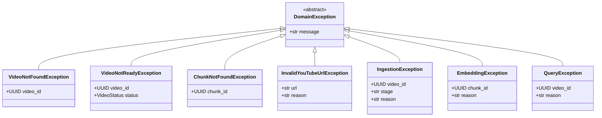

# Exceptions

Domain-specific exception types for clear error handling.

## Exception Hierarchy



## Base Exception

```python
class DomainException(Exception):
    """Base exception for all domain errors."""

    def __init__(self, message: str):
        self.message = message
        super().__init__(message)
```

## Video Exceptions

### VideoNotFoundException

Raised when a requested video doesn't exist.

```python
class VideoNotFoundException(DomainException):
    """Raised when a requested video is not found."""

    def __init__(self, video_id: UUID):
        self.video_id = video_id
        super().__init__(f"Video not found: {video_id}")
```

**Usage:**

```python
async def get_video(video_id: UUID) -> VideoMetadata:
    video = await repository.find_by_id(video_id)
    if video is None:
        raise VideoNotFoundException(video_id)
    return video
```

**API Response:**

```json
{
  "error": "VideoNotFoundException",
  "message": "Video not found: 550e8400-e29b-41d4-a716-446655440000",
  "video_id": "550e8400-e29b-41d4-a716-446655440000"
}
```

### VideoNotReadyException

Raised when attempting to query a video that's still processing.

```python
class VideoNotReadyException(DomainException):
    """Raised when attempting to query a video that isn't ready."""

    def __init__(self, video_id: UUID, status: VideoStatus):
        self.video_id = video_id
        self.status = status
        super().__init__(
            f"Video {video_id} is not ready. Current status: {status.value}"
        )
```

**Usage:**

```python
async def query_video(video_id: UUID, query: str) -> QueryResponse:
    video = await get_video(video_id)
    if not video.is_ready():
        raise VideoNotReadyException(video_id, video.status)
    # Process query...
```

---

## Chunk Exceptions

### ChunkNotFoundException

Raised when a specific chunk doesn't exist.

```python
class ChunkNotFoundException(DomainException):
    """Raised when a requested chunk is not found."""

    def __init__(self, chunk_id: UUID):
        self.chunk_id = chunk_id
        super().__init__(f"Chunk not found: {chunk_id}")
```

---

## URL Exceptions

### InvalidYouTubeUrlException

Raised when a URL isn't a valid YouTube URL.

```python
class InvalidYouTubeUrlException(DomainException):
    """Raised when a YouTube URL is invalid or unsupported."""

    def __init__(self, url: str, reason: str = "Invalid URL"):
        self.url = url
        self.reason = reason
        super().__init__(f"Invalid YouTube URL '{url}': {reason}")
```

**Usage:**

```python
def validate_youtube_url(url: str) -> YouTubeVideoId:
    if "youtube.com" not in url and "youtu.be" not in url:
        raise InvalidYouTubeUrlException(url, "Not a YouTube domain")

    try:
        return YouTubeVideoId.from_url(url)
    except Exception:
        raise InvalidYouTubeUrlException(url, "Could not extract video ID")
```

**Common Reasons:**

| Reason | Description |
|--------|-------------|
| `Not a YouTube domain` | URL doesn't contain youtube.com or youtu.be |
| `Could not extract video ID` | No valid 11-character ID found |
| `Private or deleted video` | Video exists but isn't accessible |
| `Age-restricted video` | Video requires authentication |
| `Region-blocked video` | Video not available in server region |

---

## Processing Exceptions

### IngestionException

Raised when video ingestion fails at any stage.

```python
class IngestionException(DomainException):
    """Raised when video ingestion fails."""

    def __init__(self, video_id: UUID, stage: str, reason: str):
        self.video_id = video_id
        self.stage = stage
        self.reason = reason
        super().__init__(
            f"Ingestion failed for {video_id} at {stage}: {reason}"
        )
```

**Stages:**

| Stage | Description |
|-------|-------------|
| `download` | Failed to download video from YouTube |
| `transcription` | Failed to transcribe audio |
| `frame_extraction` | Failed to extract video frames |
| `chunking` | Failed to create chunks |
| `embedding` | Failed to generate embeddings |
| `storage` | Failed to store artifacts |

**Usage:**

```python
async def ingest_video(url: str) -> VideoMetadata:
    video = await create_video_record(url)

    try:
        await download_video(video)
    except DownloadError as e:
        raise IngestionException(video.id, "download", str(e))

    try:
        await transcribe_video(video)
    except TranscriptionError as e:
        raise IngestionException(video.id, "transcription", str(e))

    # Continue with other stages...
```

### EmbeddingException

Raised when embedding generation fails.

```python
class EmbeddingException(DomainException):
    """Raised when embedding generation fails."""

    def __init__(self, chunk_id: UUID, reason: str):
        self.chunk_id = chunk_id
        self.reason = reason
        super().__init__(f"Embedding failed for chunk {chunk_id}: {reason}")
```

**Common Reasons:**

| Reason | Description |
|--------|-------------|
| `API rate limit exceeded` | Too many requests to embedding service |
| `Invalid input` | Text too long or image corrupted |
| `Service unavailable` | Embedding service is down |
| `Authentication failed` | Invalid API key |

---

## Query Exceptions

### QueryException

Raised when a query operation fails.

```python
class QueryException(DomainException):
    """Raised when a query operation fails."""

    def __init__(self, video_id: UUID, reason: str):
        self.video_id = video_id
        self.reason = reason
        super().__init__(f"Query failed for video {video_id}: {reason}")
```

**Common Reasons:**

| Reason | Description |
|--------|-------------|
| `No relevant content found` | Vector search returned no results |
| `LLM service unavailable` | Cannot reach language model |
| `Context too large` | Retrieved chunks exceed context window |
| `Invalid query` | Query is empty or malformed |

---

## Exception Handling

### In Services

```python
class VideoIngestionService:
    async def ingest(self, url: str) -> IngestVideoResponse:
        try:
            video_id = YouTubeVideoId.from_url(url)
        except InvalidYouTubeUrlException:
            raise  # Let it propagate

        try:
            video = await self._process_video(video_id)
            return IngestVideoResponse(video_id=video.id, status="ready")
        except IngestionException as e:
            await self._mark_failed(e.video_id, e.reason)
            raise
```

### In API Layer

```python
from fastapi import HTTPException

@router.post("/videos/ingest")
async def ingest_video(request: IngestVideoRequest):
    try:
        return await ingestion_service.ingest(request.url)
    except InvalidYouTubeUrlException as e:
        raise HTTPException(status_code=400, detail={
            "error": "InvalidYouTubeUrl",
            "url": e.url,
            "reason": e.reason
        })
    except IngestionException as e:
        raise HTTPException(status_code=500, detail={
            "error": "IngestionFailed",
            "video_id": str(e.video_id),
            "stage": e.stage,
            "reason": e.reason
        })
```

### HTTP Status Code Mapping

| Exception | HTTP Status | Description |
|-----------|-------------|-------------|
| `VideoNotFoundException` | 404 | Resource not found |
| `VideoNotReadyException` | 409 | Conflict - video still processing |
| `ChunkNotFoundException` | 404 | Resource not found |
| `InvalidYouTubeUrlException` | 400 | Bad request |
| `IngestionException` | 500 | Internal server error |
| `EmbeddingException` | 500 | Internal server error |
| `QueryException` | 500 | Internal server error |

---

## Best Practices

### 1. Include Context

```python
# Good: Include relevant context
raise IngestionException(
    video_id=video.id,
    stage="transcription",
    reason=f"Whisper API returned error: {api_error.message}"
)

# Bad: Vague error
raise Exception("Transcription failed")
```

### 2. Catch Specific Exceptions

```python
# Good: Handle specific cases
try:
    video = await get_video(video_id)
except VideoNotFoundException:
    return {"error": "Video not found"}
except VideoNotReadyException as e:
    return {"error": f"Video is {e.status.value}, please wait"}

# Bad: Catch everything
try:
    video = await get_video(video_id)
except Exception:
    return {"error": "Something went wrong"}
```

### 3. Log Before Raising

```python
async def process_video(video_id: UUID) -> None:
    try:
        await do_processing()
    except SomeError as e:
        logger.error(
            "Processing failed",
            extra={"video_id": str(video_id), "error": str(e)}
        )
        raise IngestionException(video_id, "processing", str(e))
```

## Related

- [VideoMetadata](video-metadata.md) - Video status handling
- [API Error Handling](../api/errors.md) - HTTP error responses
- [Design Principles](../architecture/design-principles.md) - Error handling patterns
