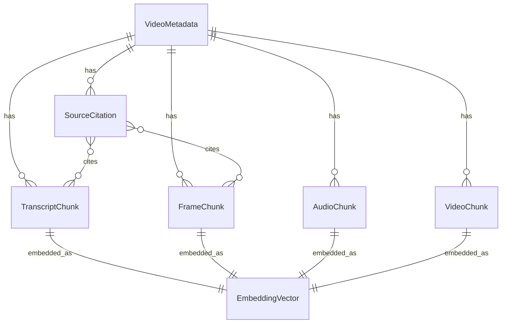

# Domain Layer

The domain layer contains pure business entities that represent the core concepts of the YouTube RAG system. These models are free from infrastructure concerns and define the vocabulary of the business domain.

## Overview

## Core Entities

-   :material-video:{ .lg .middle } __VideoMetadata__

    ---

    Core entity representing an indexed YouTube video

    [:octicons-arrow-right-24: Details](video-metadata.md)

-   :material-content-cut:{ .lg .middle } __Chunks__

    ---

    Multimodal content segments (transcript, frame, audio, video)

    [:octicons-arrow-right-24: Details](chunks.md)

-   :material-vector-point:{ .lg .middle } __Embeddings__

    ---

    Vector representations for semantic search

    [:octicons-arrow-right-24: Details](embeddings.md)

-   :material-format-quote-close:{ .lg .middle } __Citations__

    ---

    Source references with temporal positioning

    [:octicons-arrow-right-24: Details](citations.md)

-   :material-tag:{ .lg .middle } __Value Objects__

    ---

    Immutable domain primitives

    [:octicons-arrow-right-24: Details](value-objects.md)

-   :material-alert-circle:{ .lg .middle } __Exceptions__

    ---

    Domain-specific error types

    [:octicons-arrow-right-24: Details](exceptions.md)

## Entity Relationships

| Entity | Relationships |
|--------|---------------|
| **VideoMetadata** | Has many: TranscriptChunks, FrameChunks, AudioChunks, VideoChunks, SourceCitations |
| **TranscriptChunk** | Belongs to VideoMetadata, Has one EmbeddingVector |
| **FrameChunk** | Belongs to VideoMetadata, Has one EmbeddingVector |
| **AudioChunk** | Belongs to VideoMetadata, Has one EmbeddingVector |
| **VideoChunk** | Belongs to VideoMetadata, Has one EmbeddingVector |
| **EmbeddingVector** | Belongs to one Chunk, References VideoMetadata |
| **SourceCitation** | Belongs to VideoMetadata, References multiple Chunks |

## Storage Mapping

| Entity | Primary Storage | Secondary Storage |
|--------|----------------|-------------------|
| VideoMetadata | MongoDB | - |
| TranscriptChunk | MongoDB | Blob Storage (JSON) |
| FrameChunk | MongoDB | Blob Storage (images) |
| AudioChunk | MongoDB | Blob Storage (audio) |
| VideoChunk | MongoDB | Blob Storage (video) |
| EmbeddingVector | Qdrant | - |
| SourceCitation | MongoDB | Generated on-demand |

## Design Principles

### Pure Domain Models

- No infrastructure dependencies
- No database or API concerns
- Business logic only

### Multimodal First

- All chunk types share a common base
- Consistent temporal positioning
- Unified embedding approach

### Value Objects for Validation

- `YouTubeVideoId` ensures valid IDs
- `ChunkingConfig` validates parameters
- `TimestampRange` handles time ranges

### Explicit Exceptions

- Domain-specific exception types
- Rich error context
- Clear error messages
