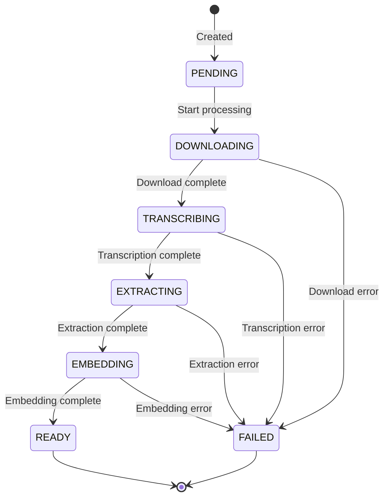

# VideoMetadata

The core entity representing an indexed YouTube video. This is the **aggregate root** for all video-related operations.

## Model Definition

```python
from enum import Enum
from datetime import datetime
from uuid import UUID
from pydantic import BaseModel, Field


class VideoStatus(str, Enum):
    """Lifecycle status of a video in the system."""
    PENDING = "pending"           # Queued for processing
    DOWNLOADING = "downloading"   # Currently downloading from YouTube
    TRANSCRIBING = "transcribing" # Extracting transcript
    EXTRACTING = "extracting"     # Extracting frames/audio
    EMBEDDING = "embedding"       # Generating embeddings
    READY = "ready"               # Fully processed and queryable
    FAILED = "failed"             # Processing failed


class VideoMetadata(BaseModel):
    """Core entity representing an indexed YouTube video."""

    # Identity
    id: UUID
    youtube_id: str
    youtube_url: str

    # YouTube metadata
    title: str
    description: str = ""
    duration_seconds: int
    channel_name: str
    channel_id: str
    upload_date: datetime
    thumbnail_url: str
    language: str | None = None

    # Processing status
    status: VideoStatus = VideoStatus.PENDING
    error_message: str | None = None

    # Timestamps
    created_at: datetime
    updated_at: datetime

    # Blob storage paths
    blob_path_video: str | None = None
    blob_path_audio: str | None = None
    blob_path_metadata: str | None = None

    # Chunk statistics
    transcript_chunk_count: int = 0
    frame_chunk_count: int = 0
    audio_chunk_count: int = 0
    video_chunk_count: int = 0
```

## Status Lifecycle



## Fields Reference

### Identity Fields

| Field | Type | Description |
|-------|------|-------------|
| `id` | `UUID` | Internal unique identifier |
| `youtube_id` | `str` | YouTube video ID (11 characters) |
| `youtube_url` | `str` | Full YouTube URL |

### YouTube Metadata

| Field | Type | Description |
|-------|------|-------------|
| `title` | `str` | Video title from YouTube |
| `description` | `str` | Video description |
| `duration_seconds` | `int` | Total duration in seconds |
| `channel_name` | `str` | YouTube channel name |
| `channel_id` | `str` | YouTube channel ID |
| `upload_date` | `datetime` | When uploaded to YouTube |
| `thumbnail_url` | `str` | URL to video thumbnail |
| `language` | `str \| None` | Primary language (ISO 639-1) |

### Processing Status

| Field | Type | Description |
|-------|------|-------------|
| `status` | `VideoStatus` | Current processing state |
| `error_message` | `str \| None` | Error details if failed |
| `created_at` | `datetime` | Record creation time |
| `updated_at` | `datetime` | Last update time |

### Storage Paths

| Field | Type | Description |
|-------|------|-------------|
| `blob_path_video` | `str \| None` | Path to video file |
| `blob_path_audio` | `str \| None` | Path to audio file |
| `blob_path_metadata` | `str \| None` | Path to metadata JSON |

### Statistics

| Field | Type | Description |
|-------|------|-------------|
| `transcript_chunk_count` | `int` | Number of transcript chunks |
| `frame_chunk_count` | `int` | Number of frame chunks |
| `audio_chunk_count` | `int` | Number of audio chunks |
| `video_chunk_count` | `int` | Number of video chunks |

## Methods

### Status Checks

```python
def is_ready(self) -> bool:
    """Check if video is fully processed and queryable."""
    return self.status == VideoStatus.READY

def is_failed(self) -> bool:
    """Check if processing failed."""
    return self.status == VideoStatus.FAILED

def is_processing(self) -> bool:
    """Check if video is currently being processed."""
    return self.status in {
        VideoStatus.DOWNLOADING,
        VideoStatus.TRANSCRIBING,
        VideoStatus.EXTRACTING,
        VideoStatus.EMBEDDING
    }
```

### Computed Properties

```python
@property
def total_chunk_count(self) -> int:
    """Total number of chunks across all modalities."""
    return (
        self.transcript_chunk_count +
        self.frame_chunk_count +
        self.audio_chunk_count +
        self.video_chunk_count
    )

@property
def duration_formatted(self) -> str:
    """Human-readable duration (HH:MM:SS)."""
    hours = self.duration_seconds // 3600
    minutes = (self.duration_seconds % 3600) // 60
    seconds = self.duration_seconds % 60

    if hours > 0:
        return f"{hours}:{minutes:02d}:{seconds:02d}"
    return f"{minutes}:{seconds:02d}"
```

### State Transitions

```python
def transition_to(self, new_status: VideoStatus) -> None:
    """Transition to a new status with validation."""
    valid_transitions = {
        VideoStatus.PENDING: {VideoStatus.DOWNLOADING},
        VideoStatus.DOWNLOADING: {VideoStatus.TRANSCRIBING, VideoStatus.FAILED},
        VideoStatus.TRANSCRIBING: {VideoStatus.EXTRACTING, VideoStatus.FAILED},
        VideoStatus.EXTRACTING: {VideoStatus.EMBEDDING, VideoStatus.FAILED},
        VideoStatus.EMBEDDING: {VideoStatus.READY, VideoStatus.FAILED},
    }

    if new_status not in valid_transitions.get(self.status, set()):
        raise ValueError(
            f"Invalid transition from {self.status} to {new_status}"
        )

    self.status = new_status
    self.updated_at = datetime.utcnow()

def mark_failed(self, error_message: str) -> None:
    """Mark the video as failed with an error message."""
    self.status = VideoStatus.FAILED
    self.error_message = error_message
    self.updated_at = datetime.utcnow()

def update_chunk_counts(
    self,
    transcript: int | None = None,
    frame: int | None = None,
    audio: int | None = None,
    video: int | None = None
) -> None:
    """Update chunk counts after processing."""
    if transcript is not None:
        self.transcript_chunk_count = transcript
    if frame is not None:
        self.frame_chunk_count = frame
    if audio is not None:
        self.audio_chunk_count = audio
    if video is not None:
        self.video_chunk_count = video
    self.updated_at = datetime.utcnow()
```

## Usage Examples

### Creating a Video Record

```python
from datetime import datetime
from uuid import uuid4

video = VideoMetadata(
    id=uuid4(),
    youtube_id="dQw4w9WgXcQ",
    youtube_url="https://www.youtube.com/watch?v=dQw4w9WgXcQ",
    title="Rick Astley - Never Gonna Give You Up",
    duration_seconds=212,
    channel_name="Rick Astley",
    channel_id="UCuAXFkgsw1L7xaCfnd5JJOw",
    upload_date=datetime(2009, 10, 25),
    thumbnail_url="https://i.ytimg.com/vi/dQw4w9WgXcQ/default.jpg",
    created_at=datetime.utcnow(),
    updated_at=datetime.utcnow()
)
```

### Processing State Machine

```python
# Start processing
video.transition_to(VideoStatus.DOWNLOADING)

# Download complete
video.blob_path_video = "videos/dQw4w9WgXcQ/original.mp4"
video.blob_path_audio = "videos/dQw4w9WgXcQ/audio.mp3"
video.transition_to(VideoStatus.TRANSCRIBING)

# Transcription complete
video.update_chunk_counts(transcript=42)
video.transition_to(VideoStatus.EXTRACTING)

# Extraction complete
video.update_chunk_counts(frame=85)
video.transition_to(VideoStatus.EMBEDDING)

# Embedding complete
video.transition_to(VideoStatus.READY)

# Check status
assert video.is_ready()
assert video.total_chunk_count == 127
```

### Handling Failures

```python
try:
    # Processing logic
    await process_video(video)
except DownloadError as e:
    video.mark_failed(f"Download failed: {e}")
except TranscriptionError as e:
    video.mark_failed(f"Transcription failed: {e}")
```

## Storage

VideoMetadata is stored in MongoDB:

```javascript
// Collection: videos
{
  "_id": "550e8400-e29b-41d4-a716-446655440000",
  "youtube_id": "dQw4w9WgXcQ",
  "youtube_url": "https://www.youtube.com/watch?v=dQw4w9WgXcQ",
  "title": "Rick Astley - Never Gonna Give You Up",
  "description": "...",
  "duration_seconds": 212,
  "channel_name": "Rick Astley",
  "channel_id": "UCuAXFkgsw1L7xaCfnd5JJOw",
  "upload_date": ISODate("2009-10-25T00:00:00Z"),
  "thumbnail_url": "https://i.ytimg.com/vi/dQw4w9WgXcQ/default.jpg",
  "language": "en",
  "status": "ready",
  "created_at": ISODate("2024-01-15T10:30:00Z"),
  "updated_at": ISODate("2024-01-15T10:35:00Z"),
  "blob_path_video": "videos/dQw4w9WgXcQ/original.mp4",
  "blob_path_audio": "videos/dQw4w9WgXcQ/audio.mp3",
  "transcript_chunk_count": 42,
  "frame_chunk_count": 85,
  "audio_chunk_count": 0,
  "video_chunk_count": 0
}
```

## Related

- [Chunks](chunks.md) - Content segments belonging to videos
- [Embeddings](embeddings.md) - Vector representations
- [Citations](citations.md) - References to video content
