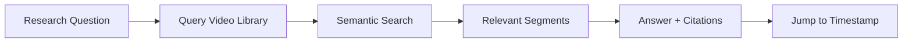
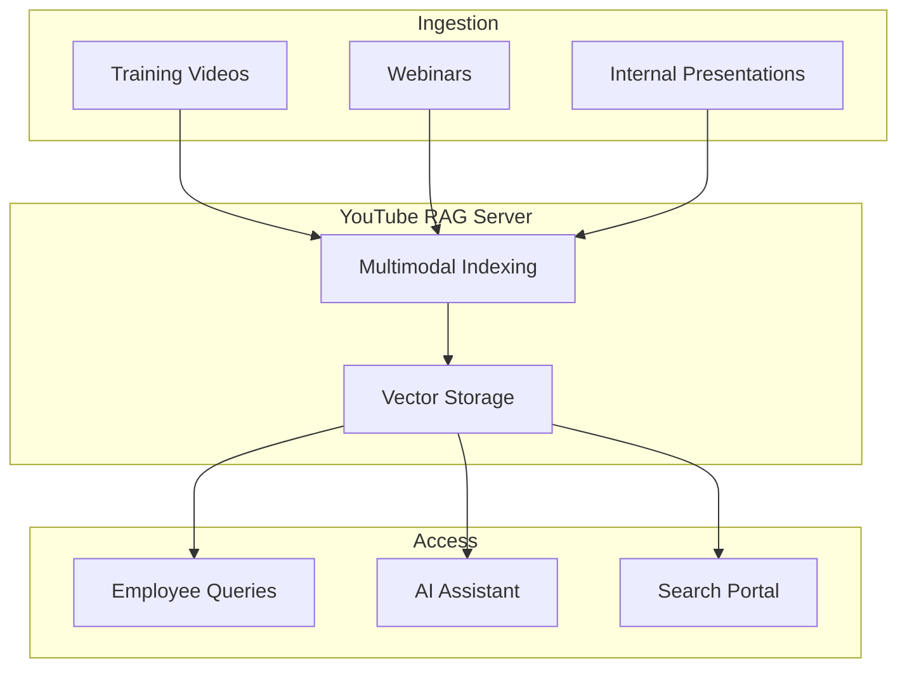
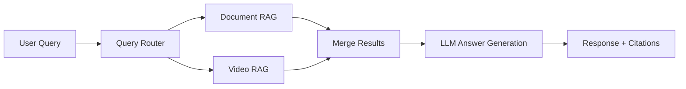

# Use Cases

YouTube RAG Server enables powerful multimodal video search and retrieval for AI agents. Here are the primary use cases.

## Research & Analysis

### Academic Research Assistant

Query video lectures, conference talks, and educational content with precise citations.



**Example workflow:**

```python
# Index a lecture series
for video_url in lecture_urls:
    await client.ingest(video_url)

# Query across all videos
results = await client.query_all(
    "What are the key differences between transformers and RNNs?",
    top_k=10
)

# Get answers with precise timestamps
for result in results:
    print(f"Video: {result.video_title}")
    print(f"Answer: {result.answer}")
    for citation in result.citations:
        print(f"  [{citation.timestamp_display}] {citation.preview}")
        print(f"  Watch: {citation.youtube_url}")
```

### Podcast Analysis

Extract insights from podcast episodes with speaker attribution.

```python
# Ingest podcast episode
video = await client.ingest(
    "https://youtube.com/watch?v=...",
    extract_frames=False,  # Audio-only content
    language_hint="en"
)

# Query specific topics
result = await video.query(
    "What did the guest say about AI regulation?"
)

# Citations include word-level timestamps
for citation in result.citations:
    print(f"[{citation.start_time:.1f}s] {citation.text}")
```

---

## Content Management

### Video Knowledge Base

Build searchable archives of organizational video content.



**Features:**

- Full-text search across transcripts
- Visual search using frame embeddings
- Temporal navigation with precise timestamps
- Batch processing for large video libraries

### Meeting Recording Search

Query recorded meetings to find specific discussions.

```python
# Index team meetings
await client.ingest(meeting_url, metadata={
    "team": "engineering",
    "date": "2024-01-15",
    "attendees": ["alice", "bob", "carol"]
})

# Find relevant discussions
results = await client.query_all(
    "When did we discuss the API redesign?",
    filters={"team": "engineering"}
)
```

---

## AI Agent Integration

### MCP Tools for Claude

Enable Claude and other AI assistants to search and cite video content.

```python
# Claude uses MCP tools
tools = [
    {
        "name": "query_video",
        "description": "Search video content and get answers with citations",
        "input_schema": {
            "type": "object",
            "properties": {
                "video_id": {"type": "string"},
                "query": {"type": "string"}
            }
        }
    }
]

# Claude can now answer questions about videos with sources
# "Based on the video [timestamp 2:34], the speaker explains..."
```

### RAG Pipeline Integration

Combine video RAG with document RAG for comprehensive knowledge retrieval.



---

## Educational Tools

### Study Aid Generator

Create study materials from educational videos.

```python
# Index course videos
course_videos = [
    "https://youtube.com/watch?v=lesson1",
    "https://youtube.com/watch?v=lesson2",
    # ...
]

for url in course_videos:
    await client.ingest(url, extract_frames=True)

# Generate study questions
result = await client.query_all(
    "What are the main concepts covered in this course?",
    include_summary=True
)

# Extract key frames for visual reference
frames = await client.get_key_frames(
    video_id,
    criteria="conceptual_diagrams"
)
```

### Interactive Tutoring

Build tutoring systems that reference specific video moments.

```python
# Student asks a question
student_query = "I don't understand gradient descent"

# Find relevant explanations
result = await video.query(student_query)

# Response includes:
# - Answer synthesized from video content
# - Direct links to video timestamps
# - Related frames/diagrams
# - Suggested follow-up sections
```

---

## Content Creation

### Video Summarization

Generate summaries with visual highlights.

```python
# Ingest video
video = await client.ingest(url, extract_frames=True)

# Generate summary
summary = await video.summarize(
    style="bullet_points",
    include_key_frames=True,
    max_length=500
)

print(summary.text)
for frame in summary.key_frames:
    print(f"[{frame.timestamp}] {frame.description}")
```

### Clip Extraction

Extract relevant clips based on semantic queries.

```python
# Find segments about a specific topic
segments = await video.find_segments(
    "explanation of neural networks",
    min_duration=30,
    max_duration=120
)

# Get video clips
for segment in segments:
    clip_url = await segment.get_clip_url()
    print(f"{segment.start_time}-{segment.end_time}: {clip_url}")
```

---

## Compliance & Documentation

### Meeting Compliance Review

Review recorded meetings for compliance requirements.

```python
# Check for required disclosures
result = await meeting_video.query(
    "Were all required risk disclosures mentioned?",
    return_evidence=True
)

# Audit trail with timestamps
for citation in result.citations:
    print(f"Evidence at {citation.timestamp_display}:")
    print(f"  {citation.text}")
```

### Training Verification

Verify employees watched and understood training content.

```python
# Generate comprehension questions
questions = await training_video.generate_questions(
    difficulty="medium",
    count=5
)

# Each question references specific video segments
for q in questions:
    print(f"Q: {q.question}")
    print(f"   Reference: {q.source_timestamp}")
```

---

## API Integrations

### Webhooks for Automation

Trigger workflows when video processing completes.

```python
# Register webhook
await client.register_webhook(
    url="https://your-app.com/webhook",
    events=["ingestion.completed", "ingestion.failed"]
)

# Webhook payload
{
    "event": "ingestion.completed",
    "video_id": "550e8400...",
    "youtube_id": "dQw4w9WgXcQ",
    "chunk_counts": {
        "transcript": 42,
        "frame": 85
    }
}
```

### Batch Processing

Process multiple videos efficiently.

```python
# Queue batch ingestion
batch = await client.create_batch([
    {"url": "https://youtube.com/watch?v=video1"},
    {"url": "https://youtube.com/watch?v=video2"},
    {"url": "https://youtube.com/watch?v=video3"},
])

# Monitor progress
while not batch.is_complete:
    status = await batch.get_status()
    print(f"Progress: {status.completed}/{status.total}")
    await asyncio.sleep(10)
```

---

## Performance Considerations

| Use Case | Recommended Settings |
|----------|---------------------|
| Short clips (<5 min) | Full extraction, 1-second frame interval |
| Long videos (>1 hour) | 5-second frame interval, transcript only |
| Audio podcasts | Disable frame extraction |
| Visual tutorials | High-res frames, dense interval |
| Large-scale indexing | Batch processing, lower resolution |

## Next Steps

- [Quick Start](quick-start.md) - Try it yourself
- [API Reference](../api/index.md) - Full API documentation
- [Architecture](../architecture/index.md) - Understand the system
