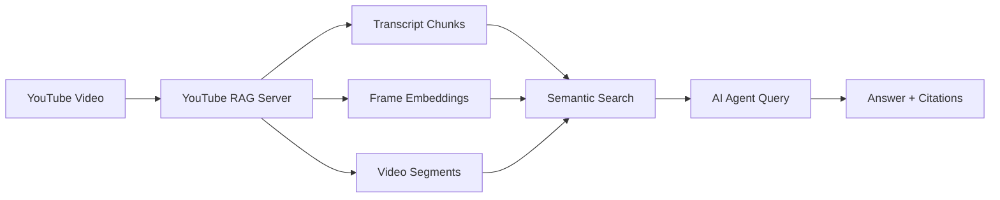
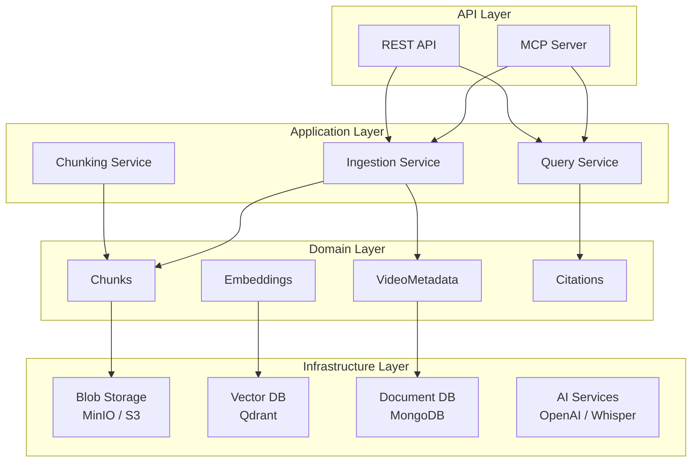

# YouTube RAG Server

<div class="grid cards" markdown>

-   :material-rocket-launch:{ .lg .middle } __Get Started in 5 Minutes__

    ---

    Install YouTube RAG Server and start indexing videos for semantic search

    [:octicons-arrow-right-24: Quick Start](getting-started/quick-start.md)

-   :material-architecture:{ .lg .middle } __Architecture__

    ---

    Understand the hexagonal architecture, layers, and design principles

    [:octicons-arrow-right-24: System Overview](architecture/index.md)

-   :material-api:{ .lg .middle } __API Reference__

    ---

    REST API and MCP tools for AI agent integration

    [:octicons-arrow-right-24: API Docs](api/index.md)

-   :material-cog:{ .lg .middle } __Configuration__

    ---

    Configure providers, storage, and AI services

    [:octicons-arrow-right-24: Configuration](configuration/index.md)

</div>

---

## What is YouTube RAG Server?

YouTube RAG Server is an **MCP Server + OpenAPI Plugin** that enables LLM agents to index and query YouTube video content in a **multimodal fashion** (text, audio, frames, video segments), with **temporal precision** for source citations.

### Key Features

- **Multimodal Indexing**: Process video into transcript chunks, frames, audio segments, and video clips
- **Temporal Citations**: Every query response includes precise timestamps linking back to source material
- **AI Agent Integration**: MCP tools for Claude, GPT, and other AI assistants
- **Pluggable Infrastructure**: Swap storage, vector DB, and AI providers without code changes
- **Production Ready**: Kubernetes deployment, GitOps, monitoring, and observability

### Use Cases



| Use Case | Description |
|----------|-------------|
| **Research Assistant** | Query video lectures, podcasts, interviews with precise citations |
| **Content Analysis** | Extract insights from video libraries with multimodal understanding |
| **Knowledge Base** | Build searchable video archives for organizations |
| **Educational Tools** | Create study aids from educational content |

---

## Architecture at a Glance

YouTube RAG Server follows a **layered hexagonal architecture**:



[:octicons-arrow-right-24: Learn more about the architecture](architecture/index.md)

---

## Quick Example

=== "MCP Tool (Claude)"

    ```python
    # Claude uses the ingest_video tool
    result = await mcp.call_tool("ingest_video", {
        "url": "https://youtube.com/watch?v=dQw4w9WgXcQ",
        "extract_frames": True
    })

    # Query the video
    answer = await mcp.call_tool("query_video", {
        "video_id": result["video_id"],
        "query": "What is the main topic discussed?"
    })
    # Returns answer with timestamp citations
    ```

=== "REST API"

    ```bash
    # Ingest a video
    curl -X POST http://localhost:8000/api/v1/videos/ingest \
      -H "Content-Type: application/json" \
      -d '{"url": "https://youtube.com/watch?v=dQw4w9WgXcQ"}'

    # Query the video
    curl -X POST http://localhost:8000/api/v1/videos/{video_id}/query \
      -H "Content-Type: application/json" \
      -d '{"query": "What is the main topic discussed?"}'
    ```

=== "Python SDK"

    ```python
    from youtube_rag import YouTubeRAGClient

    client = YouTubeRAGClient("http://localhost:8000")

    # Ingest
    video = await client.ingest("https://youtube.com/watch?v=...")
    await video.wait_until_ready()

    # Query
    result = await video.query("What is the main topic?")
    for citation in result.citations:
        print(f"[{citation.timestamp}] {citation.text}")
    ```

---

## Technology Stack

| Component | Technology |
|-----------|-----------|
| **Language** | Python 3.11+ |
| **API Framework** | FastAPI |
| **Blob Storage** | MinIO (dev), S3/GCS (prod) |
| **Vector Database** | Qdrant |
| **Document Database** | MongoDB |
| **Transcription** | OpenAI Whisper |
| **Embeddings** | OpenAI text-embedding-3-small, CLIP |
| **LLM** | OpenAI GPT-4o |
| **Video Processing** | FFmpeg, yt-dlp |

---

## Getting Help

- :material-book: [Documentation](getting-started/index.md) - Full technical documentation
- :material-github: [GitHub Issues](https://github.com/youtube-rag-server/youtube-rag-server/issues) - Bug reports and feature requests
- :material-chat: [Discussions](https://github.com/youtube-rag-server/youtube-rag-server/discussions) - Questions and community

---

<div class="grid cards" markdown>

-   :material-clock-fast:{ .lg .middle } __Development Status__

    ---

    Currently in active development. See the [implementation status](reference/implementation-status.md) for details.

-   :material-scale-balance:{ .lg .middle } __License__

    ---

    MIT License - Free for commercial and personal use

</div>
